# Table of Contents

1. [Online Learning](#online_learning)
   2. [Example where O.L. is highly effective](#eg)
   3. [Possible problems](#probs)
   4. [Scaling related issues](#sri)
   5. [Incremental learning libraries](#ill)
      1. [Simple sklearn example](#sklearn_example)
2. [Maximum Likelihood estimation](#mle)
   1. [Probability Density Estimation](#pd_estimation)
   2. [Defining likelihood function](#likelihood_function)
   3. [Usage in ML](#ml_usage)
3. [Argmax](#argmax)
4. [Preprocessing for NLP tasks](#preproc_NLP)
5. [Numerical normalisation](#norm)
   1. [Batch Norm](#batch_norm)
   2. [Weight Norm](#weight_norm)
   3. [Layer Norm](#layer_norm)
   4. [Instance Norm](#instance_norm)
   5. [Group Norm](#group_norm)
   6. [Batch-Instance Norm](#batch_instance_norm)
   7. [Switchable Norm](#switchable_norm)
6. [Dataset Shifts](#dataset_shifts)
   1. [Covariate shift](#covariate_shift)
   2. [Prior probability shift](#pps)
   3. [Concept Drift](#concept_drift)
   4. [Internal Covariate Shift](#ics)
   5. Major causes
      1. [Sample selection bias](#sample_selection_bias)
      2. [Non-stationary environment](#nse)
   6. Identification
      1. Supervised
         1. xsax
      2. Unsupervised
         1. [Statistical Distance](#id_sd)
         2. [Novelty Detection](#nd)
         3. [Discriminative distance](#dd)
7. [AUC-ROC curve](#aucroc)
   1. [Multiclass classfication](#auc_roc_multiclass)
8. [Confusion matrix](#conf_mat)
   1. [Metrics](#metrics)
      1. [Accuracy](#acc)
      2. [Precision](#prec)
      3. [Recall](#recall)
      4. [F-score](#f_score)
   2. [For multi-class classification](#conf_mat_multiclass)
9. [Entropy Loss](#epl)
   1. [Sparse categorical crossentropy](#scc)
   2. [Categorical Crossentropy](#cc)
10. [Curse of dimensionality](#cod)
11. [Cross-validation](#cv)
12. [Method of lagrangian multiplier](#lagrangian)
13. [Univariate, Bi-variate, Multi-variate Analysis](#mva)
14. [Bias-Variance Tradeoff](#bias-variance)


# Online Learning<a name="online_learning"></a>

[reference tutorial](https://medium.com/value-stream-design/online-machine-learning-515556ff72c5)

A.K.A. - incremental learning of out-of-core learning.

usually ML models are static in nature - once parameters are learned, only inferencing can take place. 

They are also [***horizontally scalable***](https://github.com/akshayDev17/DEVELOPER-NOTES).


ML practitioners do the following to *update*(learn from newer data-set)

1. They manually train on newer data, and deploy the resulting model once they are happy with its performance
2. They schedule training on new data to take place, say, once a week and automatically deploy the resulting model<a name="daywise"></a>.
   1. this could be achieved using crontab.

**Ideal requirement**: learn as well as predict in *real time*.


## Example where O.L. is highly effective<a name="eg"></a>

Consider the following case:

* news website, displayed news article are according to type of topics clicked, and by whom they are clicked.
* predict type of news that users like, serve aptly.
* suppose government issues emergency, *everyone* is interested in domestic affairs
  * When presented with a news piece about the conference, a huge percentage of the audience clicks it to learn more.
* if [day-wise learning](#daywise) was used, model would be stuck at the same position, since its update-rate is too slow.
* With **online learning** there is no such thing as *yesterday's news*.


## Possible problems<a name="probs"></a>

1. algorithm itself might not be suitable
2. the model might fail to generalise well
3. the learning rate might be wrong
4. the regularisation might be too low or too high….......... 

In the accuracy/performance vs recent-knowledge trade-off, the latter is chosen many a times, to make the best possible decisions right *now,* its un-affordable to have a model that only knows about things that happened yesterday. 

* On exposing the model to *internet*, biased learning leading to skewed-classes.
* if learning rate too high, model might forget info learnt a second ago
* overfit/underfit
* DDoS attacks fry up the model.
* requires fast access to data.

* typically use in-memory storage like Redis(google this as well!!!).

* *Big data* processing frameworks aren’t of much help. 
* If you want to to both batch and online learning, Spark isn’t enough. 
* If you do only online learning, Spark is useless.


## Scaling-related issues<a name="sri"></a>

* model usually change from second to second, thus cannot instantiate several instances.

* technical architecture  can't be horizontally scalable.
* only a single model, parameters get updated with newer data dumps,
* most important part   **vertical scalability**
* may be unfeasible to distribute between threads as well[please google this!!!]


## Incremental learning libraries<a name="ill"></a>

[Vowpal Wabbit](https://github.com/VowpalWabbit/vowpal_wabbit) and [the scikit inspired Creme](https://creme-ml.github.io/)


### Using sklearn<a name="sklearn_example"></a>

```python
import numpy as np
from sklearn import linear_model
n_samples, n_features = 1, 500
y = np.random.randn(n_samples)
X = np.random.randn(n_samples, n_features)
clf = linear_model.SGDRegressor()
import time
start_time = time.time()
clf.partial_fit(X, y)
elapsed_time = time.time() - start_time
print(elapsed_time)
>>> 0.0008502006530761719
```

factoring in, 10ms for request processing, we could handle about 520 requests a second, or about *45 million* requests a day.


## O.L. vs Batch learning

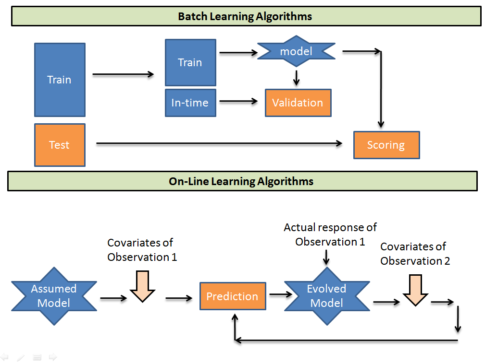

* Batch learning creates  batches of specific sizes, out of training samples, and for each batch, the parameters are updated.
* in O.L., an initially guessed model takes each sample as an input, and all weights associated with the model are updated.
* **Computationally much faster and more space efficient**
  * single pass on each sample, whereas in batch learning, multiple passes, hence faster.
  * since training happens only on newer examples, no need to store previous examples.
* **Usually easier to implement**
  * implementing a one-pass algorithm is pretty easy, as the training samples come from a continous stream.
* 
  * require a service that continously provides the *stream of data* to the model.
  *  If data changes and feature selectors no longer produce useful output
  * if major network latency between servers of feature selectors
  * if server(s) goes down
  * all this would lead the learner to tank , output is garbage.
* 
  * primary requirement of this method: no distributional assumptions(about any train/test data)
  * there is actually no *test data for evaluation*
  * no way to get a representative set that characterizes your data, 
    * thus best option to evaluate performance: <u>simply look at how well the algorithm has been doing recently.</u>
* very hard to get the algorithm to behave “correctly” on an automatic basis. 
  * It can be hard to diagnose whether your algorithm or your infrastructure is misbehaving.


# Maximum Likelihood estimation<a name="mle"></a>

[All thanks to Jason Brownlee](https://machinelearningmastery.com/what-is-maximum-likelihood-estimation-in-machine-learning/)

* given a probability distribution and distribution parameters, this involves defining a likelihood function for calculating the conditional probability


## Probability Density Estimation<a name="pd_estimation"></a>

**Joint probability distribution**

1. suppose we have a quantity X which can have any value from the observation space .
   1. it can also be a list of values X =  .
   2. this is referred to as *drawing out a sample* from the observation space.
2. want to estimate probability of X= or X =  using a function which takes in argument the value  or  *and some additional parameters*, and returns this probability value.
   1. this resulting function  p.d.f.
   2. usually, all  assumed to be IID, i.e. independent and identically distributed.
3. this problem becomes more difficult when the size of sample drawn out is small
   1. this leads to a lot of noise, thus causing erroneous probability prediction.
4. 2 common approaches for estimation:
   1. MAP(maximum a posteriori) - Bayesian method.
      1. allows prior information about the form of the solution to be harnessed.
   2. MLE(maximum likelihood estimation) - frequentist method.
      1. assumes that all solutions are equally likely beforehand


## Defining Likelihood function<a name="likelihood_function"></a>

given a specific probability distribution function and its parameters, A.K.A , maximise the probability of the joint distribution over data X.

* conditional probability =  =  , here the "|" is dropped, *";" is used* since  is *not a random variable*, but an *unknown parameter*.
* this *conditional probability* representation is called the *likelihood* function, L(X; ).


MLE deals with maximising this likelihood function, for a given value of X, by modifying the parameters .

max.(L(X; ) ) = max(L(; )) = max. 

since all probabilities are very small values, to avoid floating-point related errors, we actually consider *log likelihood function*, :

* L(X; ) = log(P(X; )), objective: maximise L(X; )

* thus L(X; ) =   

  since its common in ML practices to aim for *minimisation of a cost function*, this is transformed into: , i.e. minimise the negative log-likelihood(NLL) function.


## Usage in ML<a name="ml_usage"></a>

* fitting an ML model to generate a p.d.f. 
  * find &theta;, this is to be *predicted*, that best explains the dataset **X**.
  * cost function is the NLL function itself
* this function is typically used in *unsupervised learning*, such as <u>Clustering</u>, *Using the expected log joint probability as a key quantity for learning, in a probability model with hidden variables is better known in the context of the celebrated “<u>expectation maximisation</u>” or EM algorithm.*
  * Page 365, [Data Mining: Practical Machine Learning Tools and Techniques](https://amzn.to/2lnW5S7), 4th edition, 2016.
* it can also be used in <u>supervised learning</u>
  * for predicting Y, given sample X, and parameters &theta;.  

**as the size of the dataset increases, the quality of the MLE estimator continues to improve.**


# Argmax<a name="argmax"></a>

given a function f(x, y, z, ....) that depends on such parameters, argmax will return the values of all these input parameters which yield the maximum value of f.

for instance:

- f(1) = 1^2 = 1
- f(2) = 2^2 = 4
- f(3) = 3^2 = 9
- f(4) = 4^2 = 16
- f(5) = 5^2 = 25

then argmax(f(x)) will return 5.

this function means *return the arguments of a function that yield its maximum value*.


# NLP Preprocessing<a name="preproc_NLP"></a>

* stemming.
  * search stemming *with noise removal*:
    * punctuation removal
    * special character removal
    * numbers removal
    * HTML formatting removal
    * domain specific keyword removal(e.g. ‘RT’ for retweet)
    * source code removal
    * header removal.
    * **ETC.**
  * all the above constitutes noise removal.
* stop-word removal
* normalisation
  * For example, the word “gooood” and “gud” can be transformed to “good”, its canonical form. 
  * this is referred to as *text normalisation*.


# Normalisation<a name="norm"></a>

**Resources**

1. https://medium.com/techspace-usict/normalization-techniques-in-deep-neural-networks-9121bf100d8

**Why?**

1. prevents biasing w.r.t. features that have higher values.
   1. since it re-scales all values to be 0-1, no bias is created either w.r.t. features having small or large values.
2. prevents gradient from exploding , restrains it to a bound range
3. [In this paper](https://arxiv.org/pdf/1805.11604.pdf), authors claims that Batch Norm makes loss surface smoother(i.e. it bounds the magnitude of the gradients much more tightly).
4. reduces Internal Covariate Shift, which in turn improves training by reducing the training time.
5. unintended benefit - helps network in Regularization(only slightly, not significantly).


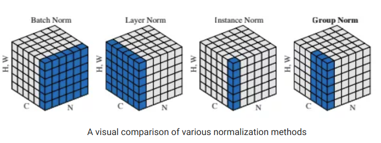

N as the batch axis, C as the channel axis, and (H, W) as the spatial axes. The pixels in blue are normalized by the same mean and variance, computed by aggregating the values of these pixels.


## Batch Norm<a name="batch_norm"></a>

* normalisation across each feature, by taking a mini-batch from the training sample, calculating mean and standard deviation.
* for a layer l(if l = 1, i..e the first layer, then the input-samples get normalised)
  ![equation](https://latex.codecogs.com/gif.latex?%5Cbegin%7Balign*%7D%20%26%5Ctextrm%7Bfor%20neurons%201....m%20of%20layer%20l%2C%20where%20activations/input%20are%20%7D%5Ctextrm%7Bz%7D%5E%7B%5Ctextrm%7B%5Bl%5D%7D%28%5Ctextrm%7B1%7D%29%7D%2C%20%5Ctextrm%7Bz%7D%5E%7B%5Ctextrm%7B%5Bl%5D%7D%28%5Ctextrm%7B2%7D%29%7D%2C%20%5Ctextrm%7Bz%7D%5E%7B%5Ctextrm%7B%5Bl%5D%7D%28%5Ctextrm%7B3%7D%29%7D.......%5Ctextrm%7Bz%7D%5E%7B%5Ctextrm%7B%5Bl%5D%7D%28%5Ctextrm%7Bm%7D%29%7D%20%5C%5C%20%26%5Cmu%5E%7B%5Ctextrm%7B%5Bl%5D%7D%7D%20%3D%20%5Cfrac%7B1%7D%7B%5Ctextrm%7Bm%7D%7D%5Csum%5Climits_%7B%5Ctextrm%7Bi%3D1%7D%7D%5E%7B%5Ctextrm%7Bm%7D%7D%5Ctextrm%7Bz%7D%5E%7B%5Ctextrm%7B%5Bl%5D%7D%28%5Ctextrm%7Bi%7D%29%7D%2C%5C%2C%20%28%5Csigma%5E%7B%5Ctextrm%7B%5Bl%5D%7D%7D%29%5E%7B%5Ctextrm%7B2%7D%7D%20%3D%20%5Cfrac%7B1%7D%7B%5Ctextrm%7Bm%7D%7D%5Csum%5Climits_%7B%5Ctextrm%7Bi%3D1%7D%7D%5E%7B%5Ctextrm%7Bm%7D%7D%28%5Ctextrm%7Bz%7D%5E%7B%5Ctextrm%7B%5Bl%5D%7D%28%5Ctextrm%7Bi%7D%29%7D-%5Cmu%5E%7B%5Ctextrm%7B%5Bl%5D%7D%7D%29%5E%7B%5Ctextrm%7B2%7D%7D%20%5C%5C%20%26%20%5Ctextrm%7Bz%7D%5E%7B%5Ctextrm%7B%5Bl%5D%7D%28%5Ctextrm%7Bi%7D%29%7D_%7B%5Ctextrm%7Bnorm%7D%7D%20%3D%20%5Cfrac%7B%5Ctextrm%7Bz%7D%5E%7B%5Ctextrm%7B%5Bl%5D%7D%28%5Ctextrm%7Bi%7D%29%7D-%5Cmu%5E%7B%5Ctextrm%7B%5Bl%5D%7D%7D%7D%7B%5Csigma%5E%7B%5Ctextrm%7B%5Bl%5D%7D%7D&plus;%5Cepsilon%7D%20%5Cend%7Balign*%7D)
* this guarantees mean=0, variance=1. &epsilon; = stability constant.
* if a different distribution is desired
   where &gamma; and &beta; are learnable parameters.
* this value **m** can either be all neurons/sample , or a portion of either(the latter is referred to as a min-batch)

**Problems:**

* batch-size = 1, doesn't allow since stddev = 0.
* small mini-batch size leads to noisy normalisation, problems while training
* problem caused in distributed training:
  * for each different machine used, mini-batch size to be kept the same, or else &gamma; , &beta; will have different values.
* recurrent activation for each time-step will have different statistical distribution
  * hence for each time step, repeat this batch normalisation.
  * space consuming, complex, since forced to compute and store information for each different statistic(each layer at each different time-step)

* [This study](https://arxiv.org/pdf/1805.11604.pdf) claims that using this doesn't primarily solve the internal covariate shift problem, it rather smoothens out the loss surface.

## Weight Norm<a name="weight_norm"></a>

* normalise weights instead of activations/input.
* , where ||&nu;|| = determinant of weight-matrix &nu;.
* authors use a combination of mean batch normalisation and weight normalisation, i.e. subtract the activation/input from their mini-batch mean value, but don't divide by the corresponding variance. 
  * Instead, normalise the weights, and then do the feed-forward part.
  * Mean is less noisy as compared to variance(which above makes mean a good choice over variance) due to the[ law of large numbers](https://whatis.techtarget.com/definition/law-of-large-numbers).
  * this technique achieved the best results on CIFAR-10.


## Layer Norm<a name="layer_norm"></a>


## Instance Norm<a name="instance_norm"></a>

## Group Norm<a name="group_norm"></a>

## Batch-Instance Norm<a name="batch_instance_norm"></a>

## Switchable Norm<a name="switchable_norm"></a>


# Dataset Shifts<a name="dataset_shifts"></a>

**Resources**

1. https://towardsdatascience.com/understanding-dataset-shift-f2a5a262a766
2. https://www.analyticsvidhya.com/blog/2017/07/covariate-shift-the-hidden-problem-of-real-world-data-science/

joint distribution of inputs,outputs differs between the testing and training sets.

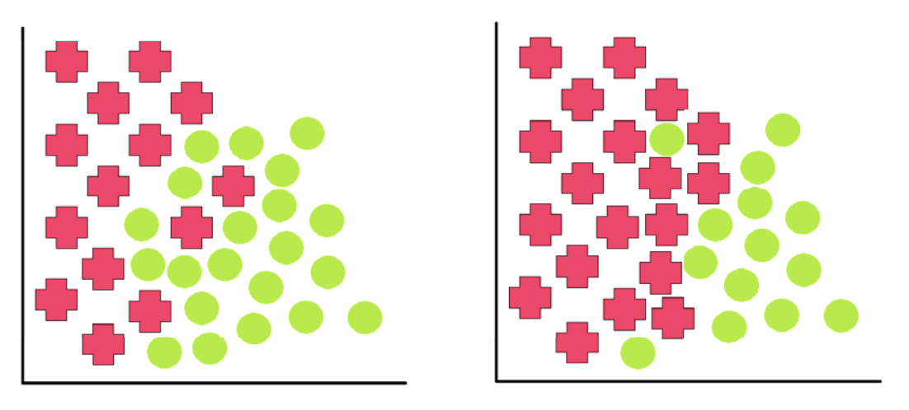

deep understanding of dataset shifting is key to winning Kaggle competitions.

its referred to as 

1. concept shift
2. concept drift
3. changes of classification
4. changing environments
5. contrast mining in classification learning
6. fracture points
7. fractures between data

If only certain features begin to diverge, how do we determine the trade-off between the loss of accuracy by  removing features and the loss of accuracy by a misrepresented data distribution?

## Covariate Shift<a name="covariate_shift"></a>

* change in the distro. of covariates, i.e. independent variables.
* appears only in XY problems, 
* 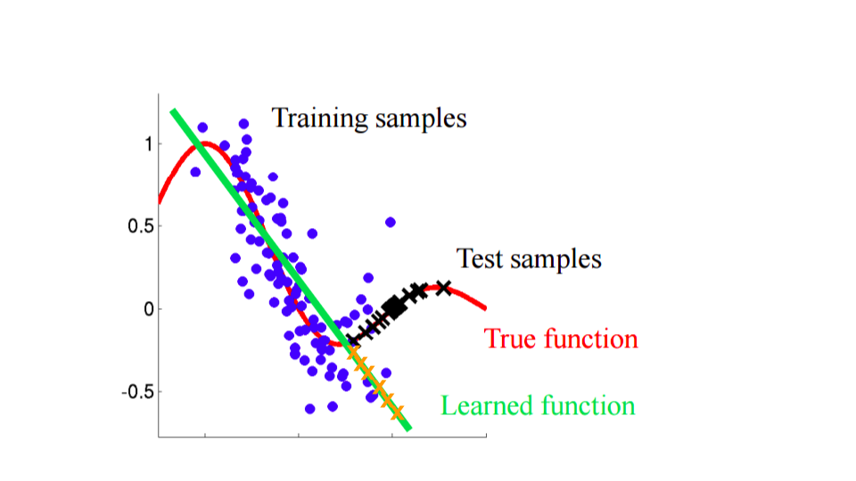
  since the training samples are aligned w.r.t. a particular function() , the model learns this function, but instead we wanted to learn the , hence the  for test samples will be highly inaccurate.
* since the test set and training set don't have same/similar distributions, although the distribution of the predicted outputs of training samples is the same as that of the target outputs of the same, for the test set its entirely different.

examples where covariate shift causes problems:

1. for the task of face recognition, if majority of training-X = young faces, and majority of testing-X = old faces
2. life-expectancy prediction, with few samples of people who smoke in the training-X, and many more examples of people who smoke in the testing-X
3. Classifying images as either cats or dogs and omitting certain species from the training set that are seen in the test set.


### Identification<a name="cov_shift_id"></a>

1. on mixing the train and test file, the model should still be able to classify an instance of the mixed dataset as  train or test with reasonable accuracy.
   1. if , for the both files, some feature(s) belong to different distributions, the model would be able to separate them easily(based on the predicted values, obviously)
   2. 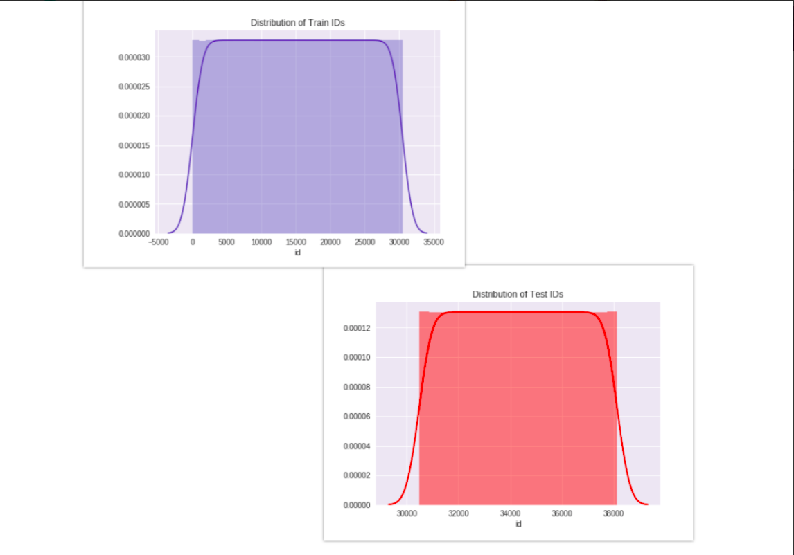
      as we can see above, the values for the feature *id* starts at v=30473 for the test distribution. hence all instances belonging to test distribution having id < 30473 belong to training set, the others, test set.
   3. in the above example, id was an example of a feature having covariate drift.
2. a common protocol:
   1. preprocess all training and testing samples, to be of the appropriate form to be fed into the model
   2. randomly draw out samples from both the sets, such that at the end, number of training samples draw is the same as that of test samples.
      1. this is done so as to avoid *unbalanced dataset* problem.
   3. train-test split of 75%,
      1. for each feature, let origin be the target variable,<font color="red"> such that we perform binary classification</font>.
      2. train the model on the 75% data as training set
      3. test on the remaining 25%, calculate the [AUC-ROC](#aucroc) value
      4. if the AUC-ROC value > 0.8, that covariate drift exists along that feature.
      5. such features are referred to as *drifting features*.
3. **Cross-validation** is almost unbiased without covariate shift but it is heavily biased under covariate shift.


### Treatment<a name="covar_treat"></a>

1. **Dropping of drifting features**
   1. find the importance of each feature w.r.t our model 
   2. simply drop those drifting features, which are non-important, for the ML task.
2. **Importance weight using Density Ratio Estimation**: for each feature, repeat steps 1-3
   1. estimate training and testing densities separately.
   2. estimate the importance by taking the ratio of the estimated densities of test and train.
   3. use these as weights for determining importance of each instance in training data.
   4. rigorous task in higher dimensional data sets.
3. **Importance re-weighting**
   1. it is a more generalised idea of the above.
   2. up weight training instances that are very similar to your test instances.
   3. trying to change training data set to a distribution similar to test data set.
   4. unlabelled examples for the test domain required.
   5. may result in data leakage from the test set.
   6. 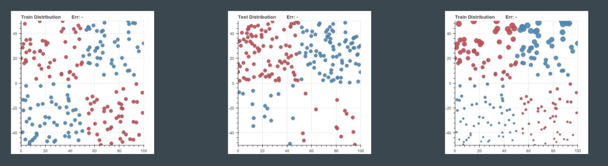
      left - training set distro., centre - test set distro., size of circles - weights of samples. colour- different kinds of labels. to make the training set *look like the test set*, appropriate re-weighting was done, hence the samples that appear to be small in the right image indicate they will be having less contribution in training the model.
4. **Adversarial search**
   1. construct a predictor that is robust to feature-deletion at test time.	
      1. finding the optimal minimax strategy, may be by either solving a quadratic program or using efficient bundle methods for optimization.


## Prior Probability Shift<a name="pps"></a>

* changes in the distribution of the class variable *y*.
  
* observed only in  problems, with  
  * intuitive example - unbalanced dataset(number of observations of a class exceeds those of other classes, by a considerable margin.)
* in actuality, even an unbalanced dataset wont always have this shift
  * for instance, suppose the email-spam classification task, balanced dataset = 50% example are spam, 50% aren't
  * in actuality, it may be so that 90% tend to be non-spam, only 10% tend to be spam mails.
* commonly associated with naive Bayes (hence the spam example, since naive Bayes is commonly used to filter spam emails).
* 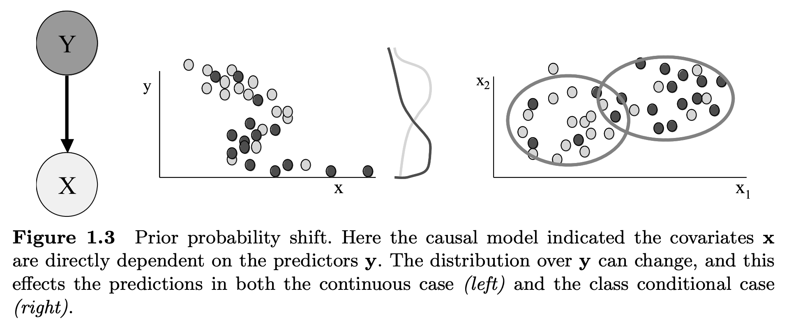
  * in the left image, the black and grey curves denote the continuous distribution of training and testing samples,
  * in the right image, the black and grey dots do the cluster representation of the same. 
  * observe that in the left, continuous distributions are different, and in the right, the cluster-population is different.


## Concept Drift<a name="concept_drift"></a>

* related to relation between independent and dependent variables.
* intuitive way of spotting this is *time series analysis*.
  * stationary time series
    * this drift is usually absent
    * relationship between the input and output is not consistently changing
  * non-stationary time series
    * this drift can be seen in such series.
    *  *detrending* the series will help make it stationary.
      * series with low autocorrelation or secular variation won't be easy to *detrend* .
*  
* 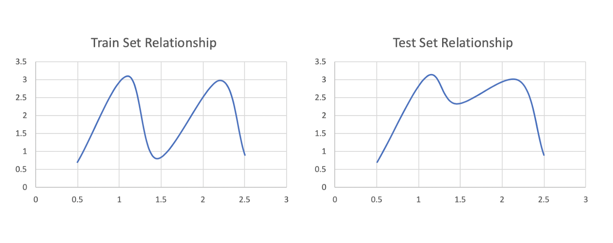
* **example**:
  * examined the profits of companies before the 2008 financial crisis
  * made an algorithm to predict the profit based on factors such as the industry, number of employees, information about products, and so on.
  * algorithm is trained on data from 2000–2007, but didn't use the dataset for 2008
  * overall relationship between the inputs and outputs changed due to the new socio-economic environment for the year 2008.
  * if these are not reflected in our variables (such as having a dummy variable for the date that the  financial crisis occurred and training data before and after this date) then our model is going to  suffer the consequences of concept shift.
  * here it can be imagined that the train data = 2000-2007, test-data = 2008, hence there is a large difference between the ***concept***, hence the difference in distributions.


## Internal Covariate Shift<a name="ics"></a>

1. suspected influence of covariance shift in the hidden layers of deep neural networks has caused the community to focus on this topic(hence the name *internal*)
2. distribution of activations for any hidden NN layer(this activation will be used as an input for ) may have the covariate shift problem which can impede the training of deep neural networks.
3. this problem was tackled in the [batch normalisation](https://arxiv.org/pdf/1502.03167.pdf) paper.
4. internal covariate shift in the hidden layers slows down training and requires lower learning rates and  careful parameter initialization. 


## Major causes - Sample selection bias<a name="sample_selection_bias"></a>

* systematic flaw in the process of data collection or labelling.
* a form of covariance shift induced.
* misrepresentation of the operating environment such that our model optimizes its training  environment to a factitious or cherry-picked operating environment.
* highly imbalanced domains(where the domain itself is defined to have skewed distribution and densities for all classes/labels), minority class is particularly sensitive to singular classification errors, due to the typically low number of samples it presents.
  * 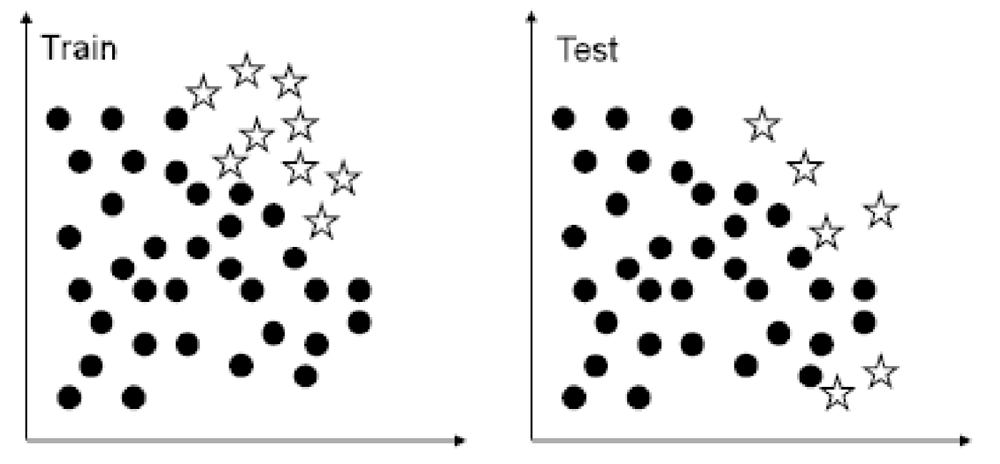
    train - cherry picked environment to suit the model
    test - actual operating environment of the model
  * In the most extreme cases, a single misclassified example of the minority class can create a significant drop in performance.


## Major causes - Non-stationary environment<a name="nse"></a>

* data varies w.r.t. time and space
  * for instance, for the problems of spam detection and network intrusion detection
* existence of an adversary that tries to work around the existing classifier’s learned concepts. 
* In terms of the machine learning task, this adversary warps the test set so that it becomes different from the training set, thus introducing any possible kind of dataset shift.
  * here by test set, we mean the operating environment of the ML classifier, which, keep in mind, is a non-stationary environment.
* once dataset shift is achieved, the adversary can appear to be in the class of *not intruded* while still managing to successfully intrude <u>undetected</u>.


## Identification

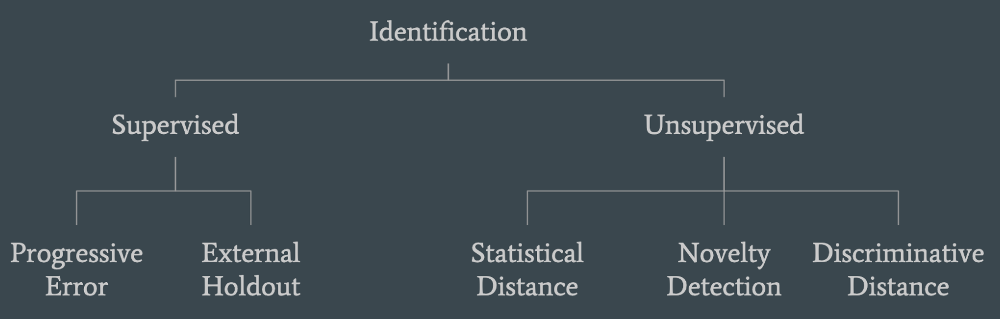

* unsupervised methods most useful ways, since no post-hoc analysis required.


## Statistical Distance<a name="id_sd"></a>

* detecting if your model predictions change over time.
*  form histograms of your training data, keep track of them over time, and compare them to see any  changes.
  * also get to check if the most important features change over time.
* commonly used by financial institutions on credit-scoring models.

1. Population stability index(PSI)
2. Kolmogrov-Smirnov statistic(KS)
3. Kullback-leibler divergence(KL divergence)
4. histogram intersections(HI)

*  not great for high-dimensional or sparse features. 
* 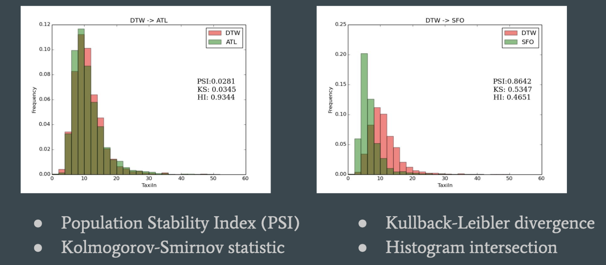
  the left has almost little to no covariate shift, but the right one, due to lower values of HI, or higher values of PSI/KS
* Correction:
  * PSI is used in risk management and an arbitrary value of 0.25 is used as the limit, above which this is deemed as a major shift.
  * such features are removed.


## Novelty Detection<a name="nd"></a>

* more effective to fairly complex domains such as computer vision.
* create a model that models(predicts) the source distribution(as some function)
* Given a new data point, model tries to test what is the likelihood that this data point is drawn from the source distribution. 
* techniques such as one-class SVMs.
* 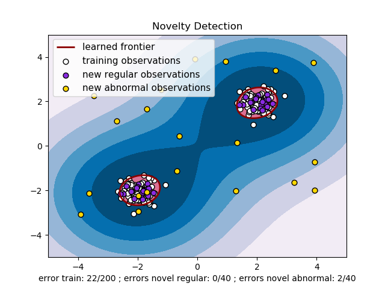
* domain of homogeneous but very complex interactions (e.g. visual, audio, or remote sensing), this is the goto method, [SD](#id_sd) won't yield any fruitful results, usually.
* 


## Discriminative distance<a name="dd"></a>

* a classifier built to detect whether a sample belongs to training(source domain) or testing set(target domain)
* distance between distributions used.
* sometimes, training error used as a proxy for this distance
  * the higher the error, the more these distributions are closer, indicating classifier is unable to discriminatingly identify the sample
* useful technique for domain adaptation.
* good for high-dimensional and sparse data


# AUC-ROC curve<a name="aucroc"></a>

**Resources**

1. [https://www.analyticsvidhya.com/blog/2020/06/auc-roc-curve-machine-learning/#:~:text=The%20Area%20Under%20the%20Curve,the%20positive%20and%20negative%20classes.](https://www.analyticsvidhya.com/blog/2020/06/auc-roc-curve-machine-learning/#:~:text=The Area Under the Curve,the positive and negative classes.)


Area under the curve(AUC) of Receiver Operator Characteristic(ROC)

Sensitivity(true positive rate, TPR), also referred to as [recall](#recall).

1. False negative rate(FNR)
   1. what % of positive predictions were falsely classified
   2. 
   3. higher recall implies lower FNR, which is desirable.
2. Specificity/True negative rate(TNR)
   1. what proportion of the negative class got correctly classified,  
   2. determining the proportion of healthy people who were correctly identified by the model.
3. False positive rate(FPR)
   1. what proportion of the negative class got incorrectly classified by the classifier,  = 1 - specificity
   2. higher TNR and a lower FPR is desirable since we want to correctly classify the negative class.


##Probability of predictions<a name="prob_pred"></a> 

1. instead of a model spewing out just the predicted label of a given sample, it would be much better from an analytics standpoint if it instead gave probability distribution w.r.t. each label, given a sample.
2. on having such a model, we can arbitrarily set a threshold value, so as to determine whether a sample belongs to a particular class or not.
3. the choice of this threshold greatly affects the value of the metrics discussed above.
4.  generate a plot between some of these metrics so that we can easily visualize which threshold is giving us a better result.
   1. this is handled by the AUC-ROC curve.
5. 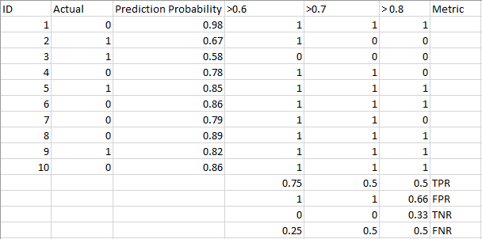


* the curve plots TPR against FPR, thus separating *signal from noise*.
* the area under this curve is the measure of ability of a classifier to distinguish between classes.
* The higher the AUC, the better the performance of the model at distinguishing between the positive and negative classes.
* 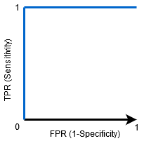
* When AUC=0.5, then the classifier is not able to distinguish between Positive and Negative class points. Meaning either the classifier is predicting random class or constant class for all the data points.
  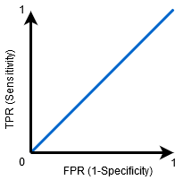


### AUC-ROC Multi-class classification<a name="auc_roc_multiclass"></a>

So, if we have three classes 0, 1, and 2, the ROC for class 0 will be generated as classifying 0 against not 0, i.e. 1 and 2. The ROC for class 1 will be generated as classifying 1 against not 1, and so on.

[refer this to relate to confusion matrix](#conf_mat_multiclass)


* for the neural network AUC-ROC curve, if the y_true is of the form y_true = [[0, 0, 1], 
            [1, 0, 0], 
            [0, 0, 1]], then use **categorical crossentropy** as the loss-metric
* if the y_true if of the form = [0], [1], [2] (already in a one-hot encoded fashion), then **sparse categorical crossentropy** is to be used as  the loss-metric.


[REFER THIS FOR THE CODE](../src/auc_roc/auc_roc.ipynb)


# Confusion matrix<a name="conf_mat"></a>

* N N matrix, N = number of target classes.

* for binary-classification
  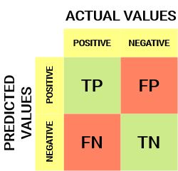

  * The target variable has two values: **Positive** or **Negative**

  * The **columns** represent the **actual values** of the target variable

  * The **rows** represent the **predicted values** of the target variable

  * **True Positive (TP)** 

    - The predicted value matches the actual value
    - The actual value was positive and the model predicted a positive value

    **True Negative (TN)** 

    - The predicted value matches the actual value
    - The actual value was negative and the model predicted a negative value

    **False Positive (FP) – Type 1 error**

    - The predicted value was falsely predicted
    - The actual value was negative but the model predicted a positive value
    - Also known as the **Type 1 error**

    **False Negative (FN) – Type 2 error**

    - The predicted value was falsely predicted
    - The actual value was positive but the model predicted a negative value
    - Also known as the **Type 2 error**


## Accuracy, Precision, Recall, F1-score<a name="metrics"></a>

* consider the problem of covid at hand, binary classification of sick people from healthy people.
* dataset at hand is highly imbalanced, out of 1000 samples, 940 are healthy, and only the rest are sick.


### Accuracy<a name="acc"></a>

* 
* TP = 30, TN = 930, FP = 30, FN = 10
* hence, accuracy = 96%, which might mean that 96% of the samples correctly.
* **but it actually means **that it can identify that out of every 100 given people, it can predict correctly for 96 people only, while it is unsure of the remaining 4(which could be devastating if it turns out that all these have the virus and are roaming freely, imagine its was the entire world population, i.e. 7 billion(7,000,000,000) then it was unable to predict for 280,000,000 i.e. 280M :worried:).
* hence for a contagion virus like the coronavirus, this metric is incorrect for model-evaluation.
  * the model should actually tell how many positive cases(infected/sick) exist, so as to restrict them from spreading the virus further into healthy people.
  * out of the correctly predicted cases, how many are positive cases to check the reliability of our model.


### Precision<a name="prec"></a>

* *tells us how many of the correctly predicted cases actually turned out to be positive.*
*  i.e. if suppose 100 people get tested through this model, and the model tells that all of them are sick(positive), then the model would only be able to guarantee that 50 of them are perfectly sick.
* useful metric in cases where False Positive is a higher concern than False Negatives.
  * hence, if precision is low, in such disease-prediction models, it would cause an unnecessary panic among people, since most of them aren't sick, but out model told them otherwise.
  * Precision is important in music or video recommendation systems, e-commerce websites, etc. 
    * Wrong results could lead to customer churn and be harmful to the business.


### Recall<a name="recall"></a>

* *tells us how many of the actual positive cases we were able to predict correctly with our model.*
*  ,75% of the positives were successfully predicted by our model.
* useful metric in cases where False Negative trumps False Positive.
  * in our disease example, recall would be the go-to metric, because out of the total infected population, our model should aim at predicting all of them to be sick, and currently its predicting 75% of them to be sick.
  * if recall would have been low, results from the model would lead to the person being accidentally discharge and let them mix with the healthy population thereby spreading the contagious virus.


### F1-score<a name="f_score"></a>

* also called f-measure, f-score .
* harmonic mean of precision and recall, i.e. 
* In practice, when we try to increase the precision of our model, the recall goes down, and vice-versa.
* F1 is maximum when precision and recall are both equal.


**[Follow this code for visualising](../src/confusion_matrix/main.ipynb)**


## For multi-class classification<a name="conf_mat_multiclass"></a>

* consider a task to predict users' favourite app among FB, insta, snapchat.

* 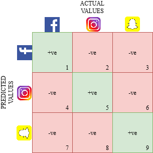

* all *+ve* mean that our prediction matched the actual app that the user liked, all such samples will constitute the TP set for each class label, i.e.

* all *-ve* mean that our prediction mismatched with the actual app that the user liked.

* | App-name | TP     | TN(model predicts the app isn't X and it turns out the favourite also wasn't X) | FP              | FN(model predicts the app isn't X but it turns out that the favourite app is X) |
  | -------- | ------ | ------------------------------------------------------------ | --------------- | ------------------------------------------------------------ |
  | FB       | cell-1 | cell-5+cell-6+cell-8+cell-9                                  | cell-2 + cell-3 | cell-4+cell-7                                                |
  | insta    | cell-5 | cell-1+cell-3+cell-7+cell-9                                  | cell-4+cell-6   | cell-2+cell-8                                                |
  | snapchat | cell-9 | cell-1+cell-2+cell-4+cell-5                                  | cell-7+cell-8   | cell-3+cell-6                                                |


# Entropy Loss<a name="epl"></a>

## Sparse categorical crossentropy<a name="scc"></a>

1. converts 

   ```python
   y_true = [[0, 0, 1], 
             [1, 0, 0], 
             [0, 0, 1]]
   ```

   to 
   y_true_one_hot = [2, 0, 2]


## Categorical crossentropy<a name="cc"></a>

1. ```python
   y_true = [[0, 0, 1],
             [1, 0, 0],
             ...
             [0, 0, 1]]
   where len(y_true) = num_samples, len(y_true[0]) = num_classes
   ```

   to

   ```python
   y_pred = [[0.1, 0.1, 0.8],
             [0.5, 0.2, 0.3],
             ...
             [0.0, 0.2, 0.8]]
   # this is in the form of predicted
   # probabilities of each class
   ```


[Follow more here](https://cwiki.apache.org/confluence/display/MXNET/Multi-hot+Sparse+Categorical+Cross-entropy#:~:text=Categorical Cross Entropy-,Definition,only belong to one class.)


# Curse of dimensionality<a name="cod"></a>

* on increasing the number of features provided to the model, its accuracy usually increases, since it is being provided with newer information, in the form of a new feature.
* hence the model gets to know more about the data, when the feature space is expanded, lets say from d = 2 to d = 10.
* this continues till a threshold value(provided number of features) is reached, beyond which the accuracy will start to decrease
* this is the curse of dimensionality
* in addition to this, if the size of the feature space increases **exponentially**, the model gets <u>confused</u> , since its being provided much more information that it can handle and also might not even be essential for an accurate prediction


# Cross-validation<a name="cv"></a>

1. used as a safety method, against a scenario where train-test split might not be random, thus still causing the model to be overfitted
   1. not a random split means that a split that might result samples having a common feature value(for eg. only people having salary in the bracket $100K/yr exist in the test data) to be clubbed into test-data, and other samples getting clubbed into train-data
2.  In cross-validation, we split our data into k subsets, and train on k-1 one of those subset. 
   1. What we do is to hold the last subset for test. 
   2. We’re able to do it for each of the subsets.
   3. 
3. 2 main types of cross-validation methods:
   1. k-fold cv
   2. leave one out CV


## K-fold cross-validation<a name="k-fold"></a>

1. split our data into k different subsets (or folds). 
2. Use k-1 subsets to train our data and leave the last subset (or the last fold) as test data. 
3. We then average the model against each of the folds and then finalize our model. 
4. After that we test it against the test set.
5. 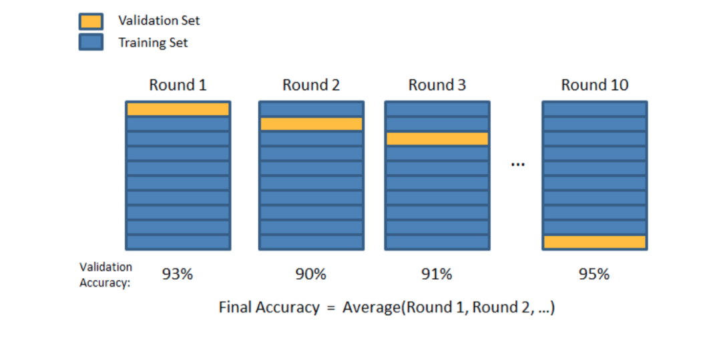
6. `kf = KFold(n_splits=2) # Define the split - into 2 folds`, here the n_splits is the parameter equivalent to k, hence in this snippet, k = 2, i.e. 
   `kf.get_n_splits(X) # returns the number of splitting iterations in the cross-validator`


## Leave-one-out CV<a name="loocv"></a>

1. the number of folds (subsets) equals to the number of observations we have in the dataset
2. average ALL of these folds and build our model with the average
3.  test the model against the last fold
4.  this method is very computationally expensive and should be used on small datasets
   1. try using on an under-sampling dataset(under-sampling done to resolve the imbalanced classification)


* for both methods, as the number of folds are increased
  * <font color="red">memory and time complexity increase</font>
  * <font color="red">erorr due to variance increases</font>
  * <font color="green">error due to bias decreases</font>
* [Splitter class](https://scikit-learn.org/stable/modules/classes.html#module-sklearn.model_selection) in this link contains the various types of cross-validation methods that can be performed, using the `sklearn-module` .


# Method of Lagrangian Multipliers<a name="lagrangian"></a>

1. consider the function to be optimised:
   	, under the constraint g(x, y) : 


# Univariate, Bi-variate, Multi-variate Analysis<a name="mva"></a>

1. univariate
   1. plot of a single feature
   2. x type of graph, y = 0(or some constant value)
   3. used mainly for creating histograms
   4. if the data ends up being aligned into certain number of bags that are distinct and roughly represent the output-label space, this means that using just this feature, we are able to classify upto some accuracy
   5. if distinct bags aren't visible, then jump to bi-variate analysis
2. bi-variate
   1. now take 2 features and plot the distribution of all samples accordingly
   2. x vs y plot
   3. if distinct clusters seen, these 2 features may be more related to labels  
   4. if not, skip to multi-variate analysis
3. multi-variate
   1. `seaborn.pairplot()` is usually used
   2. these are pairwise plots of any 2 features
   3. these can be used to find out if any correlation exists between 2 features


# Bias-variance Tradeoff<a name="bias-variance"></a>


## Bias

* difference between prediction from model and actual output
* Model with high bias pays very little attention to the training data and oversimplifies the model. 
* It always leads to high error on training and test data.
* Examples of **low-bias** machine learning algorithms include: Decision Trees, k-Nearest Neighbors and Support Vector Machines.
* Examples of **high-bias** machine learning algorithms include: Linear Regression, Linear Discriminant Analysis and Logistic Regression


## Variance

* variability of model prediction for a given data point or a value which tells us spread of our data. 
* Model with high variance pays a lot of attention to training data and **does not generalize** on the data which it hasn’t seen before. 
* As a result, such models perform very well on training data but have **high error rates on test data**.
* **Low Variance**: Suggests small changes to the estimate of the target function with changes to the training dataset.
* **High Variance**: Suggests large changes to the estimate of the target function with changes to the training dataset.
* Examples of **low-variance** machine learning algorithms include: Linear Regression, Linear Discriminant Analysis and Logistic Regression.
* Examples of **high-variance** machine learning algorithms include: Decision Trees, k-Nearest Neighbors and Support Vector Machines.


## Mathematics behind this tradeoff

1. instrument measurement/classification-detection : Y = F(X) + e, where e: noise in measurement, default error that the instrument will have regardless
   1. its usually assumed that the measurement from an instrument is perfect, i.e. e = 0, the ideal scenario
   2. its assumed that this error e is *normally distributed with mean = 0* .
   3. this means that the training data may carry noise along with it, and the amount of noise depends on this error value *e*.
2. machine learning model has to learn this function. Let its function be 
3. expected error value Err(X) =   = 
   1.  
4. hence total squared error = Bias^2 + Variance + irreducible error
5. 
   * bull's eye diagram of displaying bias and variance
   * the bull's eye, i.e. the circle at the centre represents the truth value, or the true output, and the crosses represent the values predicted by the model
   * low-bias + low-variance is the best possible model to hope for
   * if the model learns the training data too much, then it learns the pattern in the data and the noise as well, thus leading to low bias but high variance, called overfitting.
   * high variance and high bias simply represents an under-trained model.
6. 
   * models that are simple, involve less parameters are usually prone to under-fitting
   * models that are relatively complex, involve lots of parameters, are usually prone to over-fitting.
7. 
8. 
   as the above graph suggests, bias decreases with the complexity of the algorithm, but the variance increases, hence we need to find a ***sweet spot***, where both bias and variance are tolerably low.
9. 

