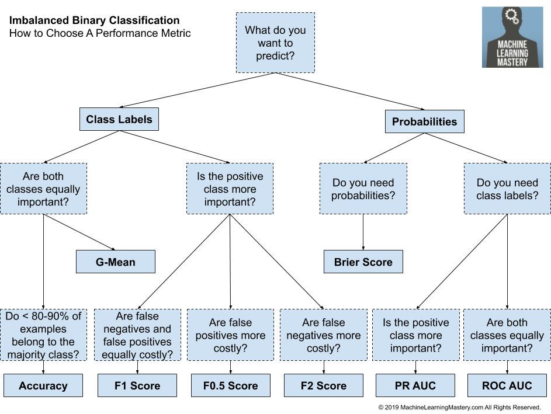

[Reference link](https://machinelearningmastery.com/tour-of-evaluation-metrics-for-imbalanced-classification/)

# Table of Contents

1. [Challenges faced with imbalanced classification](#challenges)
2. [Classifier Evaluation Metrics](#taxonomy)
   1. [Threshold Metrics](#tm)
   2. [Ranking metrics](#rm)
   3. [Probabilistic metrics](#pm)

# Challenges faced with imbalanced classifications

*  imbalanced classification problems typically rate classification errors with the minority class as more important than those with the majority class. 
* As such performance metrics may be needed that focus on the minority class, which is made challenging because it is the minority class where we lack observations required to train an effective model.

# Classifier Evaluation Metrics

1. Threshold Metrics
2. Ranking Metrics
3. Probability Metrics.

*Several machine learning researchers have identified three families of evaluation metrics used in the context of classification. These are the threshold metrics (e.g., accuracy and F-measure), the ranking methods and metrics (e.g., receiver operating characteristics (ROC) analysis and AUC), and the probabilistic metrics (e.g., root-mean-squared error).* - Page 189, [Imbalanced Learning: Foundations, Algorithms, and Applications](https://amzn.to/32K9K6d), 2013.

## Threshold Metrics for imbalanced classification

* Metrics based on a threshold and a qualitative understanding of error

1. **Accuracy** = Correct Predictions / Total Predictions

2. **Error** = Incorrect Predictions / Total Predictions

3. classification accuracy is almost universally  for imbalanced classification

   1. reason is, a high accuracy (or low error) is achievable by a no skill model that only predicts the majority class.
   2. [Failure of Classification Accuracy for Imbalanced Class Distributions](https://machinelearningmastery.com/failure-of-accuracy-for-imbalanced-class-distributions/)

4. majority class is typically referred to as the negative outcome (e.g. such as “*no change*” or “*negative test result*“), and the minority class is typically referred to as the positive outcome (e.g. “*change*” or “*positive test result*“).

5. confusion matrix for a binary (two-class) classification problem

6. **Sensitivity** = TruePositive / (TruePositive + FalseNegative)
   Specificity is the complement to sensitivity, or the true negative rate, and summarises how well the negative class was predicted.

7. **Specificity** = TrueNegative / (FalsePositive + TrueNegative)

8. For imbalanced classification, the sensitivity might be more interesting than the specificity(given the definition of the positive class).

   1. Sensitivity and Specificity can be combined into a single score that balances both concerns, i.e. their geometric mean, 

9. The Fbeta-measure measure is an abstraction of the F-measure where the balance of precision and recall in the calculation of the harmonic mean is controlled by a coefficient called *beta*.

   - **Fbeta-Measure** = 

   - **for multi-class classification**
     precision is calculated as the sum of true positives across all classes divided by the sum of true positives and false positives across all classes.

     - majority class is the negative class, but there are two positive minority classes: class 1 and class 2, for instance, 1:1:100 minority to majority class ratio,
     - 

     recall is calculated as sum of true positives across all classes divided by the sum of true positives and false negatives across all classes.

     * 

10. Other threshold metrics like *Kappa, Macro-Average Accuracy, Mean-Class-Weighted Accuracy, Optimized Precision, Adjusted Geometric Mean, Balanced Accuracy* also exist, but the ones covered before are the most popular.

11.  assumes distribution of classes, especially the minority class(es) should be the same in train and test sets

    1. it may be so that the distribution might be entirely reversed, or else the proportions may be almost comparable, making it a *balanced* classification problem

## Ranking metrics

1. classifier predicts a score or a probability of class membership
2. most commonly used ranking metric is the ROC Curve
   1. TPR vs. FPR graph
3. precision-recall curve could also be used
   1. *Precision-recall curves (PR curves) are recommended for highly skewed domains where ROC curves may provide an excessively optimistic view of the performance.* -  [A Survey of Predictive Modelling under Imbalanced Distributions](https://arxiv.org/abs/1505.01658), 2015.
   2. **focuses on** the performance of the classifier on the **minority class**.
   3. similar to the AUC-ROC curve, predictions are made at different threshold values of minority class probability, thus giving different values of precision and recall, which are then plotted to obtain this curve 
   4. 
   5. A no-skill classifier will be a horizontal line on the plot with a precision that is proportional to the number of positive examples in the dataset(*constant precision*).
      1. For a **balanced** dataset this will be **0.5**( TP = FP, cannot distinguish between whether a sample is correctly classified or wrongly into the minority class)  
   6. A perfect classifier is represented by a point in the top right.
   7. **helpful** diagnostic tool for evaluating a **single classifier** but  for  classifiers.

## Probabilistic Metrics

* measuring the deviation from the true probability
* assessment of the reliability of the classifiers not only measuring when they fail but whether they have selected the wrong class with a high or low probability
* classifiers such as MLE trained using a probabilistic framework, probabilities are already calibrated, for instance logistic regression classifiers
* Many nonlinear classifiers are not trained under a probabilistic framework and therefore require their probabilities to be calibrated against a dataset prior to being evaluated via a probabilistic metric. 
  * Examples might include support vector machines and k-nearest neighbors.
* log-loss = 
  * for multiple minority classes, 
* 

### Brier Score

1. focused more on the positive class
2. more preferable than log loss, which is focused on the entire probability distribution.
3. mean squared error between the expected probabilities for the positive class and the predicted probabilities, 
4. a perfect classifier, **brier score = 0.0**
5. differences in Brier score for different classifiers can be very small
   1. hence scaling required
   2. the brier score of a no-skill classifier can be taken as a reference, to then calculate the **Brier Skill Score(BSS)** 
   3. hence **perfect classifier, BSS = 1**

* models that predict probabilities, but require crisp class labels also included.