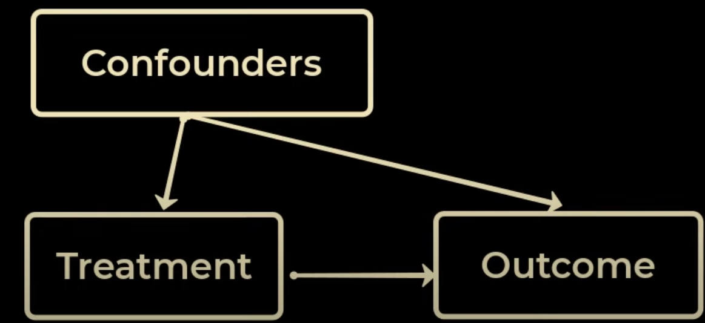

# Randomized Control Tests
- Problem statement: send targetted ads/emails to people inorder to increase purchases.
- 2 groups:
    - Treatment group: receives emails.
    - Control group: doesn't receive any emails.
- **Randomized** because selected participants are randomly assigned a group.
    - hence, **probability** of being **assigned to** a **treatment/control group** is the same, i.e. **0.5**.
- Places where these cannot be run
    - Setting up the RCT is almost impossible: **billboard ads**.
    - Experiment takes too long.
- Resolution:
    - use past data.
    - Question: How to use past data if the RCT is for an entirely original/new thing?
        - for instance, assume that data for food-delivery ad-recommendations exists.
        - the same customer basis cannot be used for a diamond-ad-recommendation because most of the samples would have a different label value.

## Challenges

### Confounders
1. Features that influence:
    1. efficacy of treatment.
    2. availability of treatment(whether the features impact a person's ability to avail the treatment).

## Selection Bias
1. Sample selected doesn't represent population.
2. for instance, sample = aged 20-30, population: avg age 45.

### Counterfactuals.
1. What would've happened if a person who was given the treatment not be given the treatment instead? Would they've naturally cured?
2. Similarly, would a person who wasn't given the treatment be given it and be cured? or be uncured?

## Assumptions

### Causal Markov Condition
- What's this?
- Causal graphs
    - 
    - 

### Stable Unit Treatment Value Assumption
- Assume a communicable disease.
- what if the person receiving treatment is in contact with a person not receiving it? Can they not cure in this case, even on getting the treatment?
- In the context of ad-recommendation, can the person being recommended the ad *pursuade* the one not being recommended for a purchase?
    - Likewise, can the person being recommended the ad *be dissuaded* by the one not being recommended from making a purchase?
- Study more on this !!

### Ignorability
- no additional confounders exist that could've affected the treatment/outcome.

## Measuring Treatment Effects
- Treatment Effects can stem from dependency on a lot of confounders.
- in addition to this, counterfactuals estimation will also be required.
- Once both exists, **Average Treatment Effect(ATE)** is the *arithmetic mean* of *Individual Treatment Effect*.
    - which is the difference in treatment outcome and control outcome.
    - $ATE = \mathcal{E}\left[Y_i(1)\right] - \mathcal{E}\left[Y_i(0)\right]$
    - $Y_i(1)$ means for people who received treatment, what was the outcome(1: cured, 0: not-cured).
- **CATE(Conditional ATE)**: based on condition(s) imposed on confounder(s), whats ATE?
    - 

# Uplift Modelling
- in the targetted-ads task, the people that make a purchase on receiving an email/ad are called **persuadables**.
- $Y$ = 0 or 1(made a purchase), $W$ = 0 or 1(was sent an ad/email), $X$: feature vector definining a person.
- ITE = $P(Y_i=1|W_i=1) - P(Y_i=1|W_i=0)$
    - a person having $W_i = 0$ can't have another entry in the $W_i=1$ since either an ad/email was recommended/sent or not.
    - hence for people with $W_i=0$ the first term needs to be estimated, and for people with $W_i=1$ the second one.
    - also notice why $Y_i=1$ in both terms. That's because we only look at persuadables/people who do make a purchase.
        - not interested in those who don't/didn't.
    

## Meta-Learning Techniques
- ML to detect hidden patterns in people-data.
- reiterating from above section, **2 models are required**: if an ad is sent, chances of purchase , if an ad is not sent, chances of purchase.
    - first model takes people with $W_i=1$, the other with $W_i=0$.
    - both will output probabilities since log-loss will be used.
- Since the logloss probabilites may not be the actual probabilities, calibration on them is performed.
    - What's Calibration? [Codemporium's Video](https://www.youtube.com/watch?v=5zbV24vyO44&t=2s)
- It could happen that model-1 outputs very high and very low probabilities(magnitude-wise), and model-2 outputs medium-low and medium-high ones.
    - the AUC-ROC curve can justify highly accuracy for both.
    - this would mean higher ITEs than reality.
    - the reverse could be true, meaning lower/negative ITEs than reality.
    - Hence the need to combine all samples into a single model.
    - ***Class Transformation Approach*** is hence used.

### Class Transformation Approach
- Define a new target variable $Z_i$ by combining $W_i, Y_i$
    - $Z_i = W_iY_i + (1-W_i)(1-Y_i)$
    - $\therefore \,, Z_i = \begin{cases} 1 & \textrm{both are 0 or 1} \\ 0 & \textrm{either is 0, but the other is 1} \end{cases}$
    - $Z_i$ is basically XNOR.
    - its 1 if either \<ad was recommended and purchase was made\> OR \<ad wasn't recommended and purchase wasn't made\> (With a small nudge, purchase is made. If the nudge is absent, so is the purchase.)
    - its 0 if either \<ad was recommended and purchase wasn't made\> OR \<ad wasn't recommended and purchase was made\> (Either the ad wasn't good enough, or wasn't necessary.)
- $ITE = 2.P(Z_i=1)-1$. Derivation:
    - **Assumption: Assigning to treatment/control group is random**. Hence $P(W_i=0)=P(W_i=1)=0.5$ (mutually exclusive events, both equal, both add up to 1).
    - Also, $P(Z_i=1) = P(Y_i=1.W_i=1) + P(Y_i=0.W_i=0)$
    - ITE = $P(Y_i=1|W_i=1) - P(Y_i=1|W_i=0)$, using $P(A|B)=\frac{P(A.B)}{P(B)}$
    - ITE = $\frac{P(Y_i=1.W_i=1)}{P(W_i=1)} - \frac{P(Y_i=1.W_i=0)}{P(W_i=0)} \Rightarrow 2\left[P(Y_i=1.W_i=1) - P(Y_i=1.W_i=0) \right]$
    - Now, $P(Y_i=1.W_i=1) + P(Y_i=1.W_i=0) + P(Y_i=0.W_i=1) + P(Y_i=0.W_i=0) = 1 \Rightarrow P(Y_i=1.W_i=0) = 1-\left(P(Y_i=1.W_i=1) + P(Y_i=0.W_i=0) + P(Y_i=0.W_i=1) \right)$
    - ITE = $2\left[P(Y_i=1.W_i=1) - 1 + P(Y_i=1.W_i=1) + P(Y_i=0.W_i=0) + P(Y_i=0.W_i=1) \right] = 2\left[P(Y_i=1.W_i=1) + P(Y_i=0.W_i=0) + P(Y_i=1.W_i=1) + P(Y_i=0.W_i=1) - 1 \right] = 2\left[P(Z_i=1) + P(W_i=1) -1 \right]$
        - either people in the treatment group will be cured($P(Y_i=1)$) or not cured($P(Y_i=0)$).
    - ITE = $2\left[P(Z_i=1) + 0.5 -1 \right] = 2\left[P(Z_i=1) -0.5 \right] = 2P(Z_i=1) -1$

## Causal Decision Trees
- [Codemporium YT video](https://www.youtube.com/watch?v=IEj8uzIG7C8)

# Propensity Score

## Reason
- availability of treatment(in observation data) depends on confounders(X), and is never truly random($P(W)=0.5$)
- hence a distribution $P(W|X)$ exists.
- to *rectify* this *bias*, propensity score is introduced.
- $e(W_i) = P(W_i=1|X_i)$, i.e. probability of getting the treatment(or being recommended an ad) w.r.t. its confounders.
- the expression for ATE = E\[ITE\] = $E[P(Y_i=1|W_i=1)] - E[P(Y_i=1|W_i=0)]$.
- on using propensity, $ATE = E\left[\frac{W_iY_i}{e(X_i)}\right] - E\left[\frac{(1-W_i)Y_i}{(1-e(X_i))}\right]$
    - uncured samples, i.e. $Y_i=0$ won't contribute to any terms.
    - untreated but cured won't contribute to the first term.
    - hence $ATE = E\left[\frac{Y_i}{e(X_i)}\right] - E\left[\frac{Y_i}{(1-e(X_i))}\right] = E\left[\frac{Y_i}{P(W_i=1|X_i)}\right] - E\left[\frac{Y_i}{(P(W_i=0|X_i))}\right]$
    - remember that for any random variable $x \rightarrow p(x), E[f(x)] = \int xf(x)dx$
    - for the new and old forms of expected values, the probability distribution of X is different.
        - in the first expression, its not conditional.
        - for the $2^{nd}$ expression, its actually $x|W_i=1$, and $x|W_i=0$
    - $E\left[\frac{Y_i}{P(W_i=1|X_i)}\right] = \int \frac{Y_i}{P(W_i=1|X_i)} P(X|W_i=1) dX$
        - using Bayes Theorem: $P(A|B).P(B)=P(B|A).P(A) \Rightarrow $

# Watchlist
- [Regression and Matching | Causal Inference in Data Science Part 1](https://www.youtube.com/watch?v=gUMhBkof7Ck)
- [Stanford Lectures on ATE](https://www.youtube.com/watch?v=ZA8iOjUR8aY&list=PLxq_lXOUlvQAoWZEqhRqHNezS30lI49G-&index=5)

# Papers
- [Robust Causal Inference for Incremental Return on Ad Spend with Randomized Paired Geo Experiments](https://research.google/pubs/robust-causal-inference-for-incremental-return-on-ad-spend-with-randomized-paired-geo-experiments/)
- 

# Practicals
- [Water Quality Causal Inference by LiNGAM](https://www.kaggle.com/code/sasakitetsuya/water-quality-causal-inference-by-lingam)

## Direct Uplift Estimation Techniques

# Resources Pending
- https://blog.ml.cmu.edu/2020/08/31/7-causality/
- [Brad Neal - Causal Inference](https://www.youtube.com/@BradyNealCausalInference)
- [Causal inference as a blind spot of data scientists](https://dzidas.com/ml/2023/10/15/blind-spot-ds/)
- [Strong ignorability: confusion on the relationship between outcomes and treatment](https://stats.stackexchange.com/questions/474616/strong-ignorability-confusion-on-the-relationship-between-outcomes-and-treatmen)
- 
