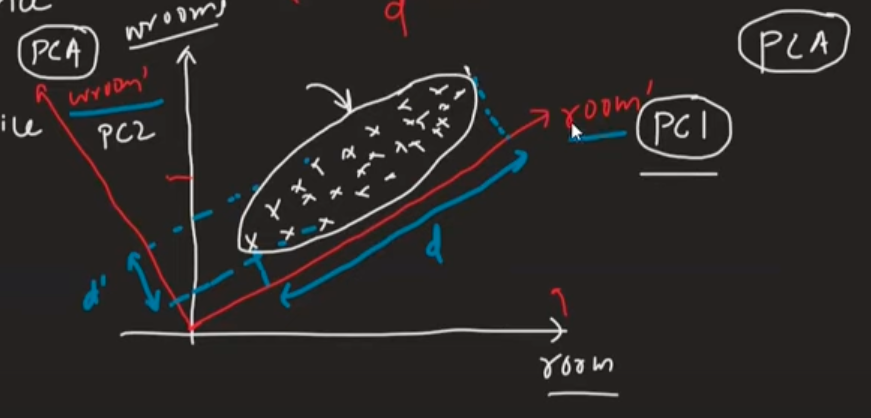

# Introduction
1. *Axis Shift* s.t. variance across *new features* changes s.t. the ones with the most *variance* can be selected.
2. Spread: MAD(mean absolute deviation), is correlated with variance, but variance is chosen since its differentiable.(modulus is not at x=0).
3. 
4. This becomes a problem of optimization because we need to find a unit vector $u$, \
    s.t. $max\left(\dfrac{\sum\limits_{i=1}^n\left(u^Tx_i - u^Tx_{m}\right)^2}{n}\right)$, where i: $i^{th}$ sample, $x_i$: its feature vector, $x_m$: a *fake* feature vector whose elements are the mean value of each feature across all samples.
    - this quantity is called finding the unit vector that maximises the projected variance of the dataset.
    - in reality, we don't get 1 unit vector but rather multiple orthogonal vectors.
    - 

# Solution
0. Mean-centre the data($x \rightarrow x-\bar{x}$)
1. Find Covariance matrix. (post mean centering, $\frac{1}{n}X^TX$)
2. Find eigenvector with largest eigenvalue.
    1. **Why Eigendecomposition?** because we need to find orthogonal directions, note that in the above intuition image, the new axis are perpendicular to each other.
    2. this may/may not be true for the original axes, i.e. original features.
3. this eigenvector is the required unit vector.
4. top d-most eigenvalues, projections along their eigenvectors = new features.
5. [Demo: increase in components leads to accuracy increase till a limit.](https://youtu.be/tofVCUDrg4M?t=90&si=Zdz1nkVQzV1pWv9N)
6. 

# Explained Variance
1. Often, a common heuristic is to select the number of components that explains a certain percentage of the total variance, such as 90% or 95%.
2. This is the component selection-explained variance tradeoff.
3. `pca.explained_variance_ratio_ = 0.9 (or 0.95)`.
4. Explained variance is nothing but the eigenvalue of that component.
5. Each principal component captures a certain amount of variance from the original data. 
    1. The **total variance of** the **dataset** is the **sum** of the **variances** captured by all the **principal components**. 
    2. The percentage of explained variance for each principal component tells us how much of the total variance is accounted for by that component.

## Why explained variance is important?
1. captures/retains the essence of the feature-info from the original features.
    1. How? feature info of the dataset = $\sum Var.(X_i)$
    2. Consider the following: 
    3. $A^2+C^2 = Var.(X_1)(\epsilon_{11}^2+\epsilon_{21}^2), B^2+D^2 = Var.(X_2)(\epsilon_{12}^2+\epsilon_{22}^2), AB+CD = Cov.(X_1, X_2).(\epsilon_{11}.\epsilon_{12}+\epsilon_{21}.\epsilon_{22}) = 0$, since this is basically dot product of eigenvectors, which are orthogonal. And **all eigenvectors** are **unit vectors**, hence we finally get $Var.(X_1) + Var.(X_2)$
2. 

# When PCA is inapplicable
1. when components dont capture enough explained variance, s.t. almost all need to be taken in order to meet the 90% requirement.
2. original Pattern is lost.
3. Data is usually expected to be linear in PCA