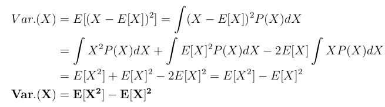
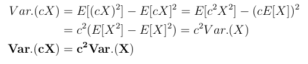
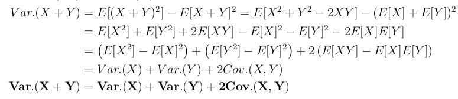
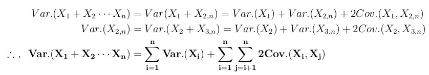
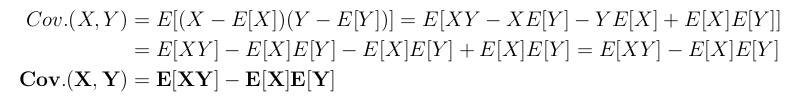
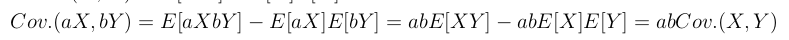

# Table of Contents

1. [Introduction](#introduction)
   1. [Inference](#inference)
2. [Non-parametric methods of estimating f](#non_param_methods)
3. [Restrictive vs flexible methods](#restrictive_vs_flexible)
4. [Qualitative vs Quantitative prediction](#prediction)
   1. [Mean-squared error(MSE)](#mse)
   2. [The bias-variance tradeoff](#bias-variance-tradeoff)
5. [Bayes classifier](#bayes-classifier)
6. [K-nearest neighbours](#knc)
7. Additional Material
   1. [Expectation identities](#ei)
   2. [Variance identities](#vi)
   3. [Covariance identities](#ci)

# Introduction

- generic form of estimating a measured variable Y using a bunch of other measurable quantities, X, takes the following form:  (y = f of X + epsilon, such that X = set of X1, X2, till X.p.)
  - here epsilon is assumed to be independent of X, normally distributed, with mean = 0, called the <u>irreducible error</u>.
  - The error term is always assumed to be drawn from a standard normal distribution due to the law of large numbers, i.e. if enough samples are taken the deviation of the error will eventually be 0.
    1. this assumption also leads to the central limit theorem, which states that:  *For independent, identically distributed random variables having a finite variance, the distribution of their average converges to a normal distribution , as the number of such random variables is increased*.
- machine learning involves predicting this unknown f of X function, where the function learnt is called f-hat of X .
  - the output given by it is called y-hat, and y-hat = f-hat of X 
  - The accuracy of Y-hat as a prediction for Y depends on two quantities, the reducible error and the irreducible error.
  - Since f-hat will not be a perfect estimate for f, some error will exist, which is called the reducible error, since this error can be tuned based on the model selection.
  - a perfect estimate will still have some error associated with it, since just using X may not be enough, since X only captures certain degrees of freedom that are of interest, but there may be a lot of degrees of freedom that may be impacting the measurement of Y which aren't considered in X. This error between Y and f of X is called the **irreducible error**, denoted by **epsilon**.
- the mean-squared, also known as expected square-error, could be expanded to a sum of reducible and irreducible error.
  - expectation of square of y minus y-hat = expectation of square of f of X + epsilon minus f-hat of X = expectation of square of f of X minus f-hat of X + expectation of square of epsilon + 2 times expectation of f of X minus f-hat of X times  epsilon.
    - since mean value of epsilon is 0, expectation of square of epsilon = variance of epsilon + square of mean of epsilon = variance of epsilon.
    - the term *expectation of square of f of X minus f-hat of X* is the **reducible error**, whereas the *variance of epsilon* is the **irreducible error**.
    - the term *2 times expectation of f of X minus f-hat of X times  expectation of epsilon* becomes 0, as per the following explanation
      - let f of X minus f-hat of X be termed as b.
      - so the term reduces to 2 times expectation of b times epsilon .
      - covariance of b and epsilon = expectation of b times epsilon minus  expectation of b times expectation of epsilon.
        the covariance term is 0, thus expectation of b times epsilon =  expectation of b times expectation of epsilon, and expectation of epsilon, i.e. the mean of epsilon, is 0, hence expectation of b times epsilon = 0.
    - ![equation](https://latex.codecogs.com/gif.latex?%5Cbegin%7Balign*%7D%20E%20%5Cleft%5B%28Y%20-%20%5Chat%7BY%7D%29%5E2%20%5Cright%5D%20%26%3D%20E%20%5Cleft%5B%28f%28X%29%20&plus;%20%5Cepsilon%20-%20%5Chat%7Bf%7D%28X%29%29%5E2%20%5Cright%5D%20%3D%20E%5Cleft%5B%20%5Cleft%28f%28X%29-%5Chat%7Bf%7D%28X%29%20%5Cright%20%29%5E2%20&plus;%20%5Cepsilon%5E2%20-2%5Cepsilon%5Cleft%28f%28X%29-%5Chat%7Bf%7D%28X%29%20%5Cright%20%29%20%5Cright%20%5D%20%5C%5C%20%26%3D%20E%5Cleft%5B%5Cleft%28f%28X%29-%5Chat%7Bf%7D%28X%29%20%5Cright%20%29%5E2%20%5Cright%5D%20&plus;%20E%5B%5Cepsilon%5E2%5D%20-2%20E%5Cleft%5B%20%5Cepsilon%5Cleft%28f%28X%29-%5Chat%7Bf%7D%28X%29%20%5Cright%20%29%20%5Cright%20%5D%20%5C%5C%20%26%3D%20%5Cleft%28f%28X%29-%5Chat%7Bf%7D%28X%29%20%5Cright%20%29%5E2%20&plus;%20Var.%28%5Cepsilon%29%20-%20E%5E2%5Cleft%5B%5Cepsilon%20%5Cright%20%5D%20-2%5Cleft%28f%28X%29-%5Chat%7Bf%7D%28X%29%20%5Cright%20%29E%5B%5Cepsilon%5D%20%5C%5C%20%26%3D%20%5Cleft%28f%28X%29-%5Chat%7Bf%7D%28X%29%20%5Cright%20%29%5E2%20&plus;%20Var.%28%5Cepsilon%29%20%5C%5C%20%5Cend%7Balign*%7D) , f(X) and f-hat(X) are both deterministic functions, hence their expectation value is their own value. 
  - only on the knowledge of Y and the function f of X can the irreducible error be quantified, and its distribution be looked at, generally only Y will ever be given.

## Inference

- while using machine learning for inference, instead of simply predicting Y given X, we want to understand the relationship between X and Y , or more specifically, to understand how Y changes as a function of X1, . . . , X.p. 
- Now f-hat cannot be treated as a black box, because we need to know its exact form. 

# Non-parametric methods of estimating f<a name="non_param_methods">

- just to be brief, **parametric methods** are the usual ML models such as linear regressor, decision tree regressor, neural networks etc, that have **certain control parameters** through which their performance can be tuned. This is because some sort of an assumption is always made when it comes to the functional form of f, when these methods are used.
- as for non-parametric methods, they do not make explicit assumptions about the functional form of f.
- hence, they have the potential to accurately fit a wider range of possible shapes for f.
  - this essentially means that may be f is linear for some range of data, may be curved for another range of data, i.e. flexible and adaptive.
- since they do not reduce the problem of estimating f to a small number of parameters, a very large number of observations (far more than is  typically needed for a parametric approach) is required in order to obtain an accurate estimate for f.
  - 
- for instance, splines are part of this approach.

# Restrictive vs flexible approach

- restrictive and flexible implies a smaller and a larger range of shapes produced as a result of estimating f-hat respectively.
- 
- If we are mainly interested in inference, then restrictive models are much more interpretable.
- very flexible approaches are difficult to understand, in terms of how any individual predictor is associated with the response.
- 

# Qualitative vs Quantitative prediction

## Mean-squared error(MSE)

- the mean of squared error, where error for a sample is the difference between prediction by f-hat and its actual value y.
- this is used to determine performance in quantitative tasks, i.e. where a quantity is to be predicted.
- it is small if predictions are very close to true responses, i.e. true Y and large if they are very far.
- there are 2 types, training and testing MSE, where the former is the MSE on the predictions of the dataset used to train a model, and the latter is on yet-unseen data, which was never used to train the model.
- the ideal ML model would yield the lowest possible train and test MSE's, i.e. both should have a value of 0, since its a perfect square, minimum will be 0.
- When a given method yields a small training MSE but a large test MSE, we are said to be overfitting the data.
  1. this happens since the model may be picking up some patterns that are just caused by random chance rather than by true properties.

## The bias-variance tradeoff

- the test MSE can be decomposed into a sum of variance of f-hat of X, i.e. the machine-learnt function, the square of the bias, i.e. the difference between f of X and f-hat of X, and the variance of epsilon, i.e. the irreducible error.

  - we had initially proved that the expectation of squared difference between Y and Y-hat was equal to the expectation of square of f of X minus f-hat of X + expectation of square of epsilon
    

  - since there is no probability distribution as f of X is a definite function, the sample isn't being drawn using a probability distribution, the exact value of f of x is known at a particular x, hence expected value of f of x is f of x and variance is 0.
    covariance is 0 since f-hat  and f are not related at all, the former   is derived from Y , and is thus independent of f.

    variance of f-hat X-i minus f of X-i is nothing but variance of f-hat of X-i , since variance of f is 0, as stated earlier, and their covariance is also 0 since they are completely independent.

    

- hence, the task becomes to select a statistical learning method that simultaneously achieves **low variance and low bias**. 

- The variance and squared bias are inherently a non-negative quantities. Hence, we see that the expected test MSE can never lie below the irreducible error.

- **Variance** - is defined as the amount by which f-hat would change if we estimated it using a different training data set. 

  - A method that has high variance under small changes in the training data can yield large changes in f-hat. 
  - restrictive methods have a lot of assumptions, imposed in the form of restrictions on the data, hence they become robust across multiple kinds of dataset, thus have a low variance.
  - for flexible methods however, since nothing is assumed, they adapt as per the data, and if the data supplied differs even slightly, the adaptive nature will cause a greater change in functional form, thus such methods are said to have a high variance . 

- **bias** refers to the error that is introduced by approximating a real-life problem, i.e. contracting Y down to y-hat, i.e. a simple predictive function learnt just from the dataset of certain degrees of freedom.

  - due to the restrictive nature of restrictive methods, they will have a higher bias, since they barely change their form, even though the dataset may have changed by a lot.
  - owing to the adaptive nature of flexible methods, they have a lower bias since they can easily change their form when the dataset changes by a lot.

- As we increase the flexibility of a class of methods, the bias tends to initially decrease faster than the variance increases. 

  - Consequently, the expected test MSE declines. 
  - However, at some point increasing flexibility has little impact on the bias but starts to significantly increase the variance. 
  - When this happens, the test MSE increases. 
  - although, its not necessary that such an even pattern is observed, it may be that as flexibility increases, the bias may keep decreasing and the variance increasing, but at a very small rate compared to the rate of bias throughout the range of data, or the bias may keep decreasing minimally but the variance may have a blowing up curve throughout the range of data.

- 

# Bayes classifier

- determined by the Bayes decision boundary, which separates the sample space into regions such that each resultant region represents only 1 category.
- The Bayes classifier will always choose the class for which the conditional probability is largest
  - this probability is defined by P of y = c-j given X = x-i, where c-j is a class and X-i is the feature vector of an observation. 
  - the class c-j for which this probability is the largest is predicted to be the class that this observation belongs to.
-  the error rate at X = x-i, i.e. a particular observation, will be 1 minus maximum of  P of (Y = c-j|X = x-i), for all possible j. 
- In general, the overall Bayes error rate is given by 1 minus expected value of maximum of  P of (Y = c-j|X = X), for all possible j, across the entire dataset. 
- Bayes classifier is the best possible representation of f-hat of X, i.e. f of X, the irreducible error is what may cause the actual class of a sample to not be the one with the maximum probability, due to other, ignored degrees of freedom.
  - hence the Bayes error rate is analogous to the irreducible rate, which will always be non-negative.
- this is the ideal, gold-standard predictive model, which can never be achieved, since there is no definite way of predicting the conditional probability distribution of the classes, given the feature-dataset.
- 

# K-nearest neighbours

-  identifies the K points in the training data that are closest to x-nought, represented by N-nought.
- the conditional probability for class j is estimated as the fraction of points in N-nought whose response values equal j: 
- as can be observed here, there is no loss function, it just gives the conditional probability distribution.
- for an increasing K
    - tendency to mislabel the points increases, but a clear, more linear, decision boundary is obtained.
    - i.e. the bias increases but the variance is reduced.
- for a decreasing K
    - The bias decreases but the variance is inflated.
- observe the resemblance in the following curves:
     
- usual parameters - k(total number of nearest neighbours to be observed) 
    distance metric - the way in which a *distance* is calculated so that these neighbours are defined.
- high prediction cost - worse for large datasets
- not good with high-dimensional data.
- categorical features won't work well.
- use case - classifies data to be analysed, i.e. nothing known about what each column represents

# Additional Material

- not part of the chapter-2, but still important.

## Expectation identities

- random variable multiplied by a constant
  - expectation is that constant times the expectation of the original random variable.
    E of k-X = 
  - 
- sum of 2 random variables
  - the definition of X + Y states that any possible value of X can be added with any possible value of Y, hence the range of all possible values of X+Y is the double summation, the first over all values of X and the second over that of Y.
  - 
  - here, P-sub-XY-of-x-y is called the joint probability distribution of x and y, and its summation over either x or y is the marginal distribution of y and x respectively.
    - marginalization can be explained with the following example.
    - Suppose we’re interested in how the *weather affects someone’s happiness* in the **United Kingdom (UK)**. 
    - We can write this mathematically as P of (happiness | given weather) i.e. what’s the probability of someone’s happiness level given the type of weather.

    - Suppose we had the equipment and definition required to measure someone’s happiness and also recorded the weather for someone in England and another in Scotland. 

    - Now it’s feasible that people in Scotland are just generally happier than people in England. 

    - The problem is that people always have a nationality so I can’t just get rid of it in the measurement. 

    - So what we’re actually measuring is P(happiness and country given weather), i.e. we’re looking at the happiness and the country at the same time.

    - Marginalisation tells us that we can calculate the quantity we want if we sum over all possibilities of countries (remember that the UK is made up of 3 countries: England, Scotland and Wales) i.e. P(happiness given weather) = P(happiness and country=England given weather) + P(happiness and country=Scotland given weather) + P(happiness and country=Wales given weather).

## Variance identities

- variance as a difference of expectation of squared random variable and square of expectation of the random variable
  - 
- variance of a constant times a random variable.
  - 
- variance of a sum of two random variables.
  - 
  - 
- variance of n random variables
  - 

## Covariance Identities

- covariance as the difference of the expectation of product of the random variables and the product of expectations of the random variables
  - 
- sum of 2 variables, each multiplied by some difference constant
  - 