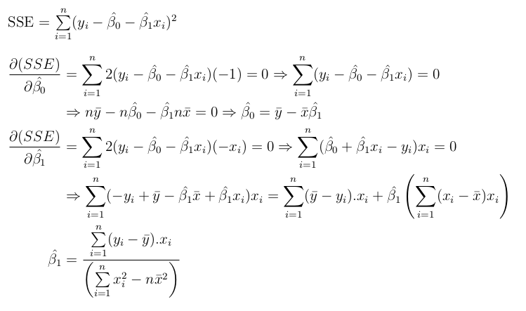

# Table of Contents

1. [Introduction](#introduction)
2. [Errors](#lr-error)
3. [Optimal Linear Regression](#optimal-lr)
4. [Inaccuracies in Sample mean and True Mean](#sample-mean-vs-true-mean)
5. [Standard Error of Sample mean](#standard-error-mu)
6. [Standard errors for the beta-parameters](#standard-error-beta)
   1. [Confidence Intervals](#ci)
7. [Residuals - SSR](#ssr)
8. [Sum of squared totals - SST](#sst)
9. [Relation between Residuals, SSE and SST](#sst,sse,ssr)
10. [Null Hypothesis](#nh)
11. [t-distribution](#t-distribution)
    1. [Introduction](#t-intro)
    2. [t-statistic of the sample-data of a random variable](#t-statistic)
    3. [p-value test for simple linear regression slope parameter](#p-value)
    4. [Obtaining T-distribution from the T-statistic](#distribution-from-statistic)
    5. [What's a t-test?](#t-test)
12. [Root Mean Square Error - Bessel's correction](#bessel)
13. R-squared statistic
    1. [Introduction](#r2-intro)
    2. [Adjusted R-squared](#adjusted-r2)
    3. [Better metrics than R-squared](#better-than-r2)
14. [Multiple Linear Regression](#mlr)
    1. [F-statistic](#f)
       1. [Degrees of Freedom in Statistics](#dof)

# Introduction

- prediction function f-hat of X is of the form beta-0 + beta-1 times X. this yields y-hat-sub-i, the predicted value of the dependent variable.
- 
- this is known as simple linear regression, wherein only 1 feature exists, when multiple features exist, then the linear regression is called as multiple linear regression.

# Errors

- difference between the actual and predicted value of the predictand , for a sample. 
- sum of squared errors is adding up the squares of these sample-errors  

# Optimal Linear Regression

- the problem becomes to find the optimal values of beta-0 and beta-1 such that the SSE is minimized.
- this can be achieved by replacing  in the expression for SSE and then differentiating the resulting expression with respect to beta-hat-0 and beta-hat-1.
- 
- 

# Inaccuracies in Sample mean and True Mean

- Since we never can have all possible samples, the dataset mean, also known as the sample mean(mu-cap,  ), **which is the mean of all true predictand values for the dataset**, will never be equal to the true mean(mu, )
  - 
  - But still, to yield a good model, its expected that an average of mu-cap( ) across all possible samples equal mu( ).
  - On the basis of one particular set of observations **mu-cap( )** might overestimate mu( ), and on the basis of another set of observations,  **mu-cap( )** might underestimate mu( ). 
  - But if we could average a huge number of estimates of mu-cap obtained from a huge number of sets of observations, then this average would exactly equal mu. 
- if we estimate the beta-parameters, on the basis of a particular data set, then our estimates won’t be exactly equal to the true value of beta-parameters, i.e. their values in the true function. 
  - But if we could average the estimates obtained over a huge number of data sets, then the average of these estimates would be spot on!

# Standard Error of Sample mean

- How accurate is the sample mean  **mu-cap( )**  as an estimate of mu( )? we answer this question by computing the standard error of  **mu-cap( )** , written as SE( **mu-cap( )** ). 
- 
- sigma is the standard deviation of each of the realizations y-sub-i of Y.
- its assumed that all y-sub-i's are independent and identically distributed, here y-1 just means the first sample's Y value, it doesn't mean a particular value, as the dataset could be shuffled row-wise, hence y-1 can have any of the sample values. similar is the argument for all other y-sub-i's.
- this deviation shrinks with n, the more observations we have, the smaller the standard error of  **mu-cap( )** .

# Standard errors for the beta-parameters

- since y-sub-i = beta-0 + beta-1 times x-sub-i + epsilon-sub-i, where beta-0 and beta-1 are assumed to be constants.
  - additionally, its also assumed that X-sub-i are also all constants, because in reality, for the given ML problem, those are constant, and aren't randomly decided.
  - what is randomly occurring is the epsilon-sub-i , i.e. the irreducible error term.
  - moreover, Y-sub-i is also unknown for the test-samples, and also its relation with beta-0 + beta-1 times X-sub-i is unknown, hence its safe to assume that since epsilon-sub-i is random, Y-sub-i is also random.

![This is the rendered form of the equation. You can not edit this directly. Right click will give you the option to save the image, and in most browsers you can drag the image onto your desktop or another program.](https://latex.codecogs.com/gif.latex?%5Chat%7B%5Cbeta%7D_1%20%3D%20%5Cfrac%7B%5Csum%5Climits_%7Bi%3D1%7D%5En%28x_i-%5Cbar%7Bx%7D%29%28y_i-%5Cbar%7By%7D%29%7D%7B%5Csum%5Climits_%7Bi%3D1%7D%5En%20%5Cleft%28%20x_i%20-%20%5Cbar%7Bx%7D%20%5Cright%20%29%5E2%7D%20%3D%20%5Cfrac%7B%5Csum%5Climits_%7Bi%3D1%7D%5En%20%28x_i-%5Cbar%7Bx%7D%29.y_i%20-%20%5Csum%5Climits_%7Bi%3D1%7D%5En%28x_i-%5Cbar%7Bx%7D%29.%5Cbar%7By%7D%7D%7B%5Csum%5Climits_%7Bi%3D1%7D%5En%20%5Cleft%28%20x_i%20-%20%5Cbar%7Bx%7D%20%5Cright%20%29%5E2%7D%20%5Cnewline%20%5CRightarrow%20%5Cfrac%7B%5Csum%5Climits_%7Bi%3D1%7D%5En%20%28x_i-%5Cbar%7Bx%7D%29.y_i%20-%20%5Cbar%7By%7D%5Csum%5Climits_%7Bi%3D1%7D%5En%28x_i-%5Cbar%7Bx%7D%29%7D%7B%5Csum%5Climits_%7Bi%3D1%7D%5En%20%5Cleft%28%20x_i%20-%20%5Cbar%7Bx%7D%20%5Cright%20%29%5E2%7D%20%3D%20%5Cfrac%7B%5Csum%5Climits_%7Bi%3D1%7D%5En%20%28x_i-%5Cbar%7Bx%7D%29.y_i%20-%20%5Cbar%7By%7D.%28n%5Cbar%7Bx%7D%20-%20n%5Cbar%7Bx%7D%29%7D%7B%5Csum%5Climits_%7Bi%3D1%7D%5En%20%5Cleft%28%20x_i%20-%20%5Cbar%7Bx%7D%20%5Cright%20%29%5E2%7D%20%5Cnewline%20%5Cmathbf%7B%5Chat%7B%5Cbeta%7D_1%20%3D%20%5Cfrac%7B%5Csum%5Climits_%7Bi%3D1%7D%5En%20%28x_i-%5Cbar%7Bx%7D%29.y_i%7D%7B%5Csum%5Climits_%7Bi%3D1%7D%5En%20%5Cleft%28%20x_i%20-%20%5Cbar%7Bx%7D%20%5Cright%20%29%5E2%7D%7D)

![This is the rendered form of the equation. You can not edit this directly. Right click will give you the option to save the image, and in most browsers you can drag the image onto your desktop or another program.](https://latex.codecogs.com/gif.latex?%5Cbegin%7Balign*%7D%20%5Chat%7B%5Cbeta%7D_1%20%26%3D%20%5Cfrac%7B%5Csum%5Climits_%7Bi%3D1%7D%5En%20%28x_i-%5Cbar%7Bx%7D%29.y_i%7D%7B%5Csum%5Climits_%7Bi%3D1%7D%5En%20%5Cleft%28%20x_i%20-%20%5Cbar%7Bx%7D%20%5Cright%20%29%5E2%7D%20%5CRightarrow%20%5Ctextrm%7Bvar.%7D%28%5Chat%7B%5Cbeta%7D_1%29%20%3D%20%5Ctextrm%7Bvar.%7D%5Cleft%28%20%5Cfrac%7B%5Csum%5Climits_%7Bi%3D1%7D%5En%20%28x_i-%5Cbar%7Bx%7D%29.y_i%7D%7B%5Csum%5Climits_%7Bi%3D1%7D%5En%20%5Cleft%28%20x_i%20-%20%5Cbar%7Bx%7D%20%5Cright%20%29%5E2%7D%20%5Cright%20%29%20%5C%5C%20%5Ctextrm%7Bvar.%7D%28%5Chat%7B%5Cbeta%7D_1%29%20%26%3D%20%5Ctextrm%7Bvar.%7D%5Cleft%28%20%5Cfrac%7B1%7D%7B%5Csum%5Climits_%7Bi%3D1%7D%5En%20%5Cleft%28%20x_i%20-%20%5Cbar%7Bx%7D%20%5Cright%20%29%5E2%7D.%5Csum%5Climits_%7Bi%3D1%7D%5En%20%28x_i-%5Cbar%7Bx%7D%29.y_i%20%5Cright%20%29%20%3D%20%5Cleft%28%20%5Cfrac%7B1%7D%7B%5Csum%5Climits_%7Bi%3D1%7D%5En%20%5Cleft%28%20x_i%20-%20%5Cbar%7Bx%7D%20%5Cright%20%29%5E2%7D%20%5Cright%20%29%5E2%20.%5Ctextrm%7Bvar.%7D%5Cleft%28%20%5Csum%5Climits_%7Bi%3D1%7D%5En%20%28x_i-%5Cbar%7Bx%7D%29.y_i%20%5Cright%20%29%20%5Cend%7Balign*%7D)

* since all X-sub-i's are constant, their mean, X-bar, will also be constant, hence the sum of squares of the difference between X-sub-i and X-bar over all i's, from 1 to n, is also constant, and hence can be pulled out from the expression of the variance.
* 
  
  * under the assumption that any 2 error terms are uncorrelated, i.e. all error have a pairwise 0 correlation.
*  

- Notice that the standard error for the slope parameter, i.e. beta-1-hat, is smaller when the x-sub-i are more spread out; intuitively we have more leverage to estimate a slope when this is the case.

## Confidence Intervals

- A 95 % confidence interval is defined as a range of values such that with 95 % interval probability, the range will contain the true unknown value of the parameter.
- 
- 

# Residuals

- the part of the variance of predictand values that is left unexplained by the regression model. 

# Sum of squared totals

- the entire variance of the predictands. 

# Relation between Residuals, SSE and SST

- SST = SSE + SSR.
- 

# Null Hypothesis

-  The most common hypothesis test involves testing the null hypothesis of  *H0 : There is no relationship between X and Y* .
- This is compared to the alternative hypothesis alternative hypothesis *Ha : There is some relationship between X and Y* .
- basically, H0 means  , and Ha means 
- to prove the alternative hypothesis, β1 should be sufficiently far from zero that we can be confident that β1 is non-zero. 
  - If  is small, then even relatively small values of  may provide strong evidence that  .
  - if  is large, then  must be large in absolute value in order for us to reject the null hypothesis
- hence, a t-statistic is computed to determine to the null hypothesis.
  
  - the larger the t-statistic, the farther is 0 from the  value. the smaller the probability value of the estimate of  to take up significant values, and thus the more likely it is of Y being linearly dependent on X.
  - the smaller the t-statistic, the higher chance of  to be 0, and thus the larger chance of Y being not linearly dependent on X. 
  - we say estimate, because  is estimated only for the current sample, but a different sample, i.e. a different dataset is bound to give a different .
- The probability of observing any number equal to |t| or larger in absolute value, assuming β1= 0 is called **p-value**.
- 

# t-distribution

## Introduction

- 
  - t is the variable value, and  is the degrees of freedom.
  - c is the constant used so as to normalize this function, i.e. area under the curve of this function = 1.
- this exhibits fatter tails
  - Our use of an estimate for the  variance instead of an known/assumed value interjects another source of  variation into the T-statistic that a Z-statistic doesn't have. 
  - Hence  the values of the T-statistic will vary more wildly and hence it's  distribution has fatter tails which represent that more spread out  variation.

## t-statistic of the sample-data of a random variable 

- Assume that we know that X is a random variable drawn from a normal distribution , such that we only know the mean value of that normal distribution.

- we only have n samples drawn from this distribution, and we wish to know an *approximated normal distribution*.

- calculate the sample mean and the sample variance.
  
  
  - Check [Bessel's correction](#bessel) for **why the denominator has n-1 instead of n**.
  
- the following random variable t, also called the t-statistic of the random variable X, samples a t-distribution with n-1 total degrees of freedom.
  
  - here, the t-distribution is 
  - [prove that this r.v. samples the above t-distribution function](https://www.freecodecamp.org/news/the-t-distribution-a-key-statistical-concept-discovered-by-a-beer-brewery-dbfdc693184/).
  
- ### Proof

  - since our dataset is subject to change, so is our variance of the dataset.
  - we **assume** that we have the **prior knowledge** of the **expected value of** the dependent variable, **Y**.
  - hence, for a given value of variance(a.k.a. the variance of the irreducible error), Y is normally distributed, thus we have a conditional distribution, where  is a normal distribution. 
  - the variance parameter, ,  is assumed to be distributed according to the **probability density function** of the **Gamma random variable ** 
  - Gamma Function : 
    - the gamma function can be thought of as a generalized factorial function, where 
    - the other representation of this gamma function is : , where n and h are hyperparameters that influence the distribution of this function.
    - ![This is the rendered form of the equation. You can not edit this directly. Right click will give you the option to save the image, and in most browsers you can drag the image onto your desktop or another program.](https://latex.codecogs.com/gif.latex?%5Cbegin%7Balign*%7D%20%5Ctextrm%7Bln%7D%28n%21%29%20%26%3D%20%5Csum%5Climits_%7Bi%3D1%7D%5En%20ln%28i%29%20%5Capprox%20%5Cint%5Climits_%7B1%7D%5En%20ln%28x%29dx%20%3D%20xln%28x%29-x%7C%5En_1%5C%5C%20%26%3D%20nln%28n%29%20-%20n%20-%20%280%20-%201%29%20%3D%20nln%28n%29%20-%20n%20&plus;%201%20%5Capprox%20nln%28n%29%20-%20n%20%5C%5C%20n%21%20%26%3D%20%5Cint%20%5Climits_%7B0%7D%5E%7B%5Cinfty%7D%20e%5E%7B-x%7Dx%5En%20dx%20%5C%2C%5C%2C%5C%2C%20%5Ccdots%20%5C%2C%5C%2C%5C%2C%20%5Ctextrm%7Bintegral%20definition%20of%20factorial%7D%5C%5C%20%5Cfrac%7Bd%5Cleft%28%20ln%5Cleft%28n%21%20%5Cright%20%29%20%5Cright%20%29%7D%7Bdx%7D%20%26%3D%20%5Cfrac%7Bd%5Cleft%28%20%5Cint%20%5Climits_%7B0%7D%5E%7B%5Cinfty%7D%20ln%5Cleft%28e%5E%7B-x%7Dx%5En%20%5Cright%20%29dx%20%5Cright%20%29%7D%7Bdx%7D%20%3D%20%5Cfrac%7Bd%20%5Cleft%28%20ln%28e%5E%7B-x%7Dx%5En%29%5Cright%20%29%7D%7Bdx%7D%20%5C%5C%20%26%3D%20%5Cfrac%7Bd%5Cleft%28%20nlnx%20-%20x%20%5Cright%29%7D%7Bdx%7D%20%3D%20%5Cfrac%7Bn%7D%7Bx%7D%20-%201%20%5C%5C%20%5Cmathbf%7B%5Cfrac%7Bd%5Cleft%28%20ln%28e%5E%7B-x%7Dx%5En%29%20%5Cright%20%29%7D%7Bdx%7D%7D%20%26%3D%20%5Cmathbf%7B%5Cfrac%7Bn%7D%7Bx%7D%20-%201%7D%20%5CRightarrow%20ln%5Cleft%28e%5E%7B-x%7Dx%5En%20%5Cright%29%20%3D%20nln%5Cleft%28x%20%5Cright%29%20-%20x%20%5C%5C%20%5Cend%7Balign*%7D)
    - the `n ln(x) - x` is significant only in the regions where x and n are comparable, or else the function just evaluates to n.
      ![This is the rendered form of the equation. You can not edit this directly. Right click will give you the option to save the image, and in most browsers you can drag the image onto your desktop or another program.](https://latex.codecogs.com/gif.latex?%5Cbegin%7Balign*%7D%20%26%5Ctextrm%7Bthis%20expression%20evaluates%20to%20n%2C%20except%20when%20x%20is%20comparable%20to%20n%7D%20%5C%5C%20%5Ctextrm%7B%20using%20%7D%20x%20%26%3D%20n%20&plus;%20%5Cin%20%5C%2C%5C%2C%5C%2C%20%2C%20%5C%2C%5C%2C%20%7C%5Cin%7C%20%3C%3C%3C%20n%5C%5C%20ln%5Cleft%28e%5E%7B-x%7Dn%5Ex%20%5Cright%20%29%20%26%3D%20nlnx%20-%20x%20%3D%20nln%5Cleft%28n%20&plus;%5Cin%20%5Cright%20%29%20-n-%5Cin%20%5C%5C%20nln%5Cleft%28n&plus;%5Cin%20%5Cright%20%29%20%26%3D%20nln%5Cleft%28n%5Cleft%281&plus;%5Cfrac%7B%5Cin%7D%7Bn%7D%20%5Cright%20%29%20%5Cright%20%29%20%3D%20nln%28n%29%20&plus;%20nln%5Cleft%28%201&plus;%5Cfrac%7B%5Cin%7D%7Bn%7D%5Cright%20%29%20%5C%5C%20ln%281&plus;x%29%20%26%3D%20x%20-%20%5Cfrac%7Bx%5E2%7D%7B2%7D%20&plus;%20%5Cfrac%7Bx%5E3%7D%7B3%7D%20%5Ccdots%5Ccdots%20%7Cx%7C%20%3C%3C%201%20%5C%5C%20nln%5Cleft%28n&plus;%5Cin%20%5Cright%20%29%20%26%3D%20nln%28n%29%20&plus;%20nln%5Cleft%28%201&plus;%5Cfrac%7B%5Cin%7D%7Bn%7D%5Cright%20%29%20%3D%20nln%28n%29%20&plus;%20n%5Cleft%5B%20%5Cfrac%7B%5Cin%7D%7Bn%7D%20-%20%5Cfrac%7B%5Cleft%28%20%5Cfrac%7B%5Cin%7D%7Bn%7D%20%5Cright%29%5E2%7D%7B2%7D%20&plus;%20%5Cfrac%7B%5Cleft%28%20%5Cfrac%7B%5Cin%7D%7Bn%7D%20%5Cright%29%5E3%7D%7B3%7D%20%5Ccdots%5Ccdots%20%5Cright%20%5D%20%5Capprox%20nln%28n%29%20&plus;%20%5Cin%20-%20%5Cfrac%7B%5Cin%5E2%7D%7B2n%7D%20%5C%5C%20ln%5Cleft%28e%5E%7B-x%7Dn%5Ex%20%5Cright%20%29%20%26%3D%20nln%28n%29%20&plus;%20%5Cin%20-%20%5Cfrac%7B%5Cin%5E2%7D%7B2n%7D%20-n-%5Cin%20%3D%20ln%5Cleft%28n%5En.e%5E%7B-n%7D%20%5Cright%20%29%20%5CRightarrow%20ln%5Cleft%28e%5E%7B-x%7Dn%5Ex%20%5Cright%20%29%20%3D%20ln%5Cleft%28%20n%5En.e%5E%7B-n%7D.e%5E%7B-%5Cfrac%7B%5Cin%5E2%7D%7B2n%7D%7D%20%5Cright%20%29%20%5C%5C%20%5Cend%7Balign*%7D))
    - ![This is the rendered form of the equation. You can not edit this directly. Right click will give you the option to save the image, and in most browsers you can drag the image onto your desktop or another program.](https://latex.codecogs.com/gif.latex?%5Cbegin%7Balign*%7D%20e%5E%7B-x%7Dx%5En%20%26%3D%20n%5En.e%5E%7B-n%7D.e%5E%7B-%5Cfrac%7B%5Cin%5E2%7D%7B2n%7D%7D%20%5CRightarrow%20n%21%20%3D%20%5Cint%5Climits_%7Bi%3D0%7D%5E%7B%5Cinfty%7D%20e%5E%7B-x%7Dx%5En%20dx%20%5C%2C%5C%2C%5C%2C%28x%20%3D%20n&plus;%5Cin%20%5CRightarrow%20dx%20%3D%20d%5Cin%20%29%5C%5C%20%26%5CRightarrow%20%5Cint%5Climits_%7B0%7D%5E%7B%5Cinfty%7D%20n%5En.e%5E%7B-n%7D.e%5E%7B-%5Cfrac%7B%5Cin%5E2%7D%7B2n%7D%7D%20d%5Cin%20%3D%20n%5En.e%5E%7B-n%7D%20%5Cint%5Climits_%7B%5Cmathbf%7B-n%7D%7D%5E%7B%5Cinfty%7D%20e%5E%7B-%5Cfrac%7B%5Cin%5E2%7D%7B2n%7D%7D%20d%5Cin%20%5C%5C%20%7B%5Ccolor%7BRed%7D%20%5Cint%5Climits_%7B%5Cmathbf%7B-n%7D%7D%5E%7B%5Cinfty%7D%20e%5E%7B-%5Cfrac%7B%5Cin%5E2%7D%7B2n%7D%7D%20d%5Cin%7D%20%26%5Capprox%20%7B%5Ccolor%7BRed%7D%20%5Cint%5Climits_%7B-%5Cinfty%7D%5E%7B%5Cinfty%7D%20e%5E%7B-%5Cfrac%7B%5Cin%5E2%7D%7B2n%7D%7D%20d%5Cin%20%5C%2C%5C%2C%5C%2C%5Ccdots%20n%20%5Crightarrow%20%5Cinfty%20%7D%20%3D%20%5Csqrt%7B2%5Cpi%20n%7D%5C%5C%20%5Ctherefore%20%5C%2C%5C%2C%20%2C%20%5C%2C%5C%2C%20n%21%20%26%3D%20n%5En.e%5E%7B-n%7D.%5Csqrt%7B2%5Cpi%20n%7D%20%5CRightarrow%20%5Cmathbf%7B%5CGamma%28n&plus;1%29%7D%20%3D%20%5Cmathbf%7Bn%5En.e%5E%7B-n%7D.%5Csqrt%7B2%5Cpi%20n%7D%7D%20%5C%5C%20%5Cend%7Balign*%7D)
    - hence, we can see that gamma function by itself is deterministic, hence no point in assuming that gamma function is itself a p.d.f.
    - [Source - Stirling's approximation](https://mathworld.wolfram.com/StirlingsApproximation.html) 
    - the following gives the p.d.f. of a gamma distributed random variable:
      - 
      - we **assume** that  is **gamma-distributed random variable**, with **n = n/2** , 
  - 
  - [refer this for proof](https://www.statlect.com/probability-distributions/student-t-distribution) Sunday left!!!

- 

## p-value test for simple linear regression slope parameter

- for  , to prove the fact that Y is independent of X, i.e. to prove the null hypothesis as being true, 
- Typical p-value cutoff for rejecting the null hypothesis is 0.005.

## Obtaining T-distribution from the T-statistic

- A single t-test produces a single t-value. 
- Now, imagine the following  process. 
  - First, let’s assume that the null hypothesis is true for the population. 
  - Now, suppose we repeat our study many times by drawing many random  samples of the same size from this population. 
  - Next, we perform [t-tests](#t-test) on all of the samples and plot the distribution of the t-values. 
  - This  distribution is known as a sampling distribution, which is a type of  probability distribution.

## What's a t-test?

- checks if for 2 sample-sets of same size drawn from a population have means that are reliably different from each other.
- its the ratio of variance between the groups to the variance within the groups.
- hence, the t-statistic for  is actually this, where the numerator assumes 2 distributions, the one that is available, that is used to estimate  and the other distribution has assumed that  = 0.
  - the S.E. is obtained from the sample considered, i.e. the first distribution in the numerator.
- 

# Root Mean Square Error - Bessel's correction

- 
- The RSE is an estimate of the standard deviation of  , the irreducible error. 
- instead of  we use  as the unbiased estimator of the standard deviation of the population, where both terms are calculated from the given sample, and   is the sample variance.
- [reference - wikipedia](https://en.wikipedia.org/wiki/Bessel%27s_correction)
  - this will be the proof for when degrees of freedom = n-1, i.e. only when the random variable exists, and nothing *depends* on it.
- 
- hence, for a random variable having a **normal distribution**, such that a sample-space of data is chosen from the population space
  - has the sample variance as a biased estimator of the true variance.
  - to get the unbiased estimation of the true variance,  is to be calculated, rather than .
- the variance will almost always be smaller when calculated using the sum of squared distances to the sample mean, compared to using the sum of  squared distances to the population mean.  [check here as to why exactly n-2 appears in the denominator of RSE](#f)
- Write proof for RSE in simple linear regression as well.
- **The one exception** to this is  when the **sample mean** happens to be **equal to** the **population mean**, in  which case **the variance is also equal**.
- RSE value by itself depends upon the value of the dependent variable, hence its **better to use it as** a **percentage of mean value of** the **dependent variable**.
- 
  - 
  - hence, for p=1(simple linear regression), 

#  statistic

## Introduction

- A value between 0 and 1, this **metric of accuracy** is independent of the scale of the dependent variable.
- 
  - TSS measures the total variance in the response Y , and can be squares thought of as the amount of variability inherent in the response before the regression is performed. 
  - In contrast, RSS measures the amount of variability that is left unexplained after performing the regression. 
  - Hence, **TSS - RSS** measures the  amount of variability in the response that is explained (or removed) by performing the regression.
-  A number near 0 indicates the linear model is wrong, or the inherent, i.e. irreducible error,   is high, or both. 
- **Except for linear regression**,  is a terrible metric to measure the accuracy of a regression analysis.
  - The basic problem with    is that it depends on too many things (**even when adjusted in multiple  regression**), but most especially on the variance of the independent  variables and the variance of the residuals.  
  - Normally it tells us *nothing* about *linearity* or *strength of relationship* or even *goodness of fit* for comparing a sequence of models. 
- when the independent variables are set to standard values, essentially controlling for the effect of their variance,  is really a proxy for the variance of the residuals(residual error), suitably standardized.

-  is the square of the correlation between the response(Y) and the fitted linear model(), i.e. .
- It turns out that  will always increase when more variables are added to the model, even if those variables are only weakly associated with the  response.
  - 
  - hence  is directly dependent on p, as p increases, so does the .

## Adjusted 

- The only cases where there's much of a difference between   and the adjusted-  are when you are using *loads* of parameters compared to the data (p is comparable to n).  
- A dataset of 1,000 data points, sliced up into 18 small datasets, the slicing added only 18 parameters; the  adjustments to  wouldn't even affect the second decimal place, except possibly in the  end segments where there were only a few dozen data points: and it would *lower* them.

## Better metrics than 

- For **model selection** you can look to AIC and BIC = ?.
- For expressing the adequacy of a model, look at the variance of the residuals. 

# Multiple Linear Regression

## F-statistic

- while t-statistic is used to  tell you if a *single* variable is statistically significant, this test is used to test if a *group* of variables are jointly significant.

- hence, all predictor variables need to be checked, which is why f-statistic is preferred in multiple linear regression.

- 

- 

- it can be easily proved, with the assumption that the linear model(linear regression) is used, that 
  - we had earlier seen this for [simple linear regression](#bessel), where p=1

  - ### Degrees of Freedom in Statistics

    - degrees of freedom is the effective number of parameters of the model required to **even estimate the regression**, i.e. the slope(a vector of dimensions p) and the coefficient.

    - [source for intuitive explanation of degrees of freedom](https://www.youtube.com/watch?v=4otEcA3gjLk&list=WL&index=37&t=236s)
      
      - this video explains that y=mx+c needs exactly 2 points to define a line, x being the single-feature independent variable and y being the dependent variable.
      - this causes the model to yield  =1 , hence the relation between y and x cannot be assessed, and only after the addition of the 3rd point is when the model gains some *freedom* to assess the strength of the relation between y and x 
      - **Note** : we are trying to **draw the best-fit line**, i.e. minimum sum of least squares.
      - anything less than this imparts freedom for the regression line itself, i.e. for n = 1 point, infinite number of lines can pass through this point, hence infinite values of m and c, hence **no best-fit line possible**.
      - The problem is that when we have more parameters than observations(n > p), there is a risk of overfitting the training dataset
      
    - we assume the feature vector X to be  thus the weight vector becomes  , and thus we differentiate p times, w.r.t each basis(or component/dimension of the weight vector) , thus obtain p constraints .

    - as [machinelearningmastery](https://machinelearningmastery.com/degrees-of-freedom-in-machine-learning/) says, : "*degrees of freedom = number of independent values – number of statistics*" , here the **number of independent values is n**(since n dependent variables are to be predicted) and **p number of statistics**  , i.e. number of constraints employed.
      - for instance, in [simple linear regression](#optimal-lr), we get the 2 listed constraints , hence the remaining degrees of freedom becomes *n-2* , which is also seen in its corresponding expression of [RMSE](#bessel).
      - **Note: ** in simple linear regression, it looks as if X is  but its actually  since X actually is appended with a column vector of the same dimensionality will all elements as 1, i.e.  
      
    - The mathematical definition of d.o.f. is  , 
      - for instance, for the claim that *the predicted values of each sample is the **sample mean*** , with the mean being , , the d.o.f. is  
      - thus, the randomly samples vector  has the total number of degrees as n-1, since after randomly sampling the value of  , it  becomes fixed, hence only the variables  to  are free to move, since the  variable is linearly dependent on these n-1 values and the fixed-mean-value.
      
    - coming back to our definition of multiple linear regression, the final estimation mapping is  
      - here,  is the predicted values for all samples, and H is called the hat-matrix(since it produces the predicted values, i.e. *hatting the Y*)
      - this H is  , and for instance, n = 2, then 
      - this hat-matrix is
        - symmetric in nature, i.e. 
        - idempotent in nature, i.e. 
        - 
        - this states that for multiplication of **square matrices**, the trace of the product is **invariant in cyclic permutations**.
        - 
  
- [mathematical explanation of degrees of freedom and divergence function](https://towardsdatascience.com/the-official-definition-of-degrees-of-freedom-in-regression-faa04fd3c610)
  
- we have to use the [definition](https://math.stackexchange.com/questions/626732/linear-regression-degrees-of-freedom-of-sst-ssr-and-rss) of degrees of freedom
  
- ![This is the rendered form of the equation. You can not edit this directly. Right click will give you the option to save the image, and in most browsers you can drag the image onto your desktop or another program.](https://latex.codecogs.com/gif.latex?SST%20%3D%20SSE%20&plus;%20SSR%20%5CRightarrow%20d.f.%28SST%29%20%3D%20d.f.%28SSE%29%20&plus;%20d.f.%28SSR%29%20%5CRightarrow%20d.f.%28SSE%29%20%3D%20d.f.%28SST%29%20-%20d.f.%28SSE%29%20%5Cnewline%20%5Cbegin%7Balign*%7D%20d.f.%28SST%29%20%3D%20d.f.%28y%20-%20%5Cbar%7By%7D%29%20%26%3D%20d.f.%5Cleft%28%5Cbegin%7Bbmatrix%7D%20y_1%20-%20%5Cfrac%7By_1%20&plus;%20y_2%20&plus;%20%5Ccdots%20y_n%7D%7Bn%7D%20%5C%5C%20y_2%20-%20%5Cfrac%7By_1%20&plus;%20y_2%20&plus;%20%5Ccdots%20y_n%7D%7Bn%7D%20%5C%5C%20%5Cvdots%20%5C%5C%20y_n%20-%20%5Cfrac%7By_1%20&plus;%20y_2%20&plus;%20%5Ccdots%20y_n%7D%7Bn%7D%20%5Cend%7Bbmatrix%7D%20%5Cright%20%29%20%3D%20%5Csum%5Climits_%7Bi%3D1%7D%5En%20%5Cfrac%7B%5Cpartial%20%5Cleft%28y_i%20-%20%5Cfrac%7B%5Csum%5Climits_%7Bj%3D1%7D%5En%20y_j%7D%7Bn%7D%20%5Cright%20%29%7D%7B%5Cpartial%20y_i%7D%20%5C%5C%20%26%3D%20n%20-%20%5Cfrac%7B1%7D%7Bn%7D%20%5Csum%5Climits_%7Bi%3D1%7D%5En%20%5Cfrac%7B%5Cpartial%20%5Cleft%28%5Csum%5Climits_%7Bj%3D1%7D%5En%20y_j%20%5Cright%29%7D%7B%5Cpartial%20y_i%7D%20%3D%20n-1%20%5C%5C%20d.f.%28SSR%29%20%3D%20d.f.%28%5Chat%7By%7D%20-%20%5Cbar%7By%7D%29%20%26%3D%20d.f.%28X.%5Chat%7B%5Cbeta%7D%20-%20%5Cbar%7By%7D%29%20%3D%20d.f.%28X%5Chat%7B%5Cbeta%7D%29%20-%20d.f.%28%5Cbar%7By%7D%29%20%5C%5C%20d.f.%28X%20%5Ccdot%20%5Chat%7B%5Cbeta%7D%29%20-%201%20%3D%20d.f.%28X%5Ccdot%20%28X%5ETX%29%5E%7B-1%7DX%5ET%29%20-%201%20%26%3D%20d.f.%28X%5ETX%20%28X%5ETX%29%5E%7B-1%7D%29%20-%201%20%3D%20d.f.%28I_%7Bp&plus;1%20%5Ctimes%20p&plus;1%7D%20-%201%29%20%3D%20p&plus;1-1%20%5C%5C%20%5Ctherefore%20%5C%2C%2C%5C%2C%20d.f.%28SSE%29%20%3D%20n-1%20-%20p%20%26%3D%20n-p-1%20%5C%5C%20%5Cend%7Balign*%7D)
  
- here the dimensionality is p+1 , since we have included an extra value in  (for bias, i.e. ) , and thus an extra column of all 1's in X, thus making X = n x p+1.
  
- ![This is the rendered form of the equation. You can not edit this directly. Right click will give you the option to save the image, and in most browsers you can drag the image onto your desktop or another program.](https://latex.codecogs.com/gif.latex?%5Cbegin%7Balign*%7D%20Y%20%26%3D%20X%5Ccdot%20%5Cbeta%20&plus;%20%5Cin%20%5C%5C%20%5Chat%7BY%7D%20%3D%20HY%20%3D%20X%28X%5ETX%29%5E%7B-1%7DX%5ET%5Ccdot%20Y%20%26%3D%20X%28X%5ETX%29%5E%7B-1%7DX%5ET%20%5Ccdot%20%5Cleft%28X%5Ccdot%20%5Cbeta%20&plus;%20%5Cin%20%5Cright%20%29%20%3D%20X%5Cbeta%20&plus;%20H%20%5Cin%20%5C%5C%20Y%20-%20%5Chat%7BY%7D%20%3D%20%5Cin%20-%20H%20%5Cin%20%26%3D%20%5C%2C%20%5Cleft%28I%20-%20H%20%5Cright%20%29%5Cin%5C%5C%20%5Cleft%28Y%20-%20%5Chat%7BY%7D%20%5Cright%20%29%5ET%20%3D%20%5Cleft%28%20%5Cleft%28I%20-%20H%20%5Cright%20%29%20%5Cin%20%5Cright%20%29%5ET%20%26%3D%20%5Cin%5ET%20%28I-H%29%5ET%20%3D%20%5Cin%5ET%28I%20-%20H%29%20%5C%5C%20SSE%20%3D%20%5Csum%5Climits_%7Bi%3D1%7D%5En%20%28y_i%20-%20%5Chat%7By_i%7D%29%5E2%20%3D%20%28Y%20-%20%5Chat%7BY%7D%29%5ET%28Y%20-%20%5Chat%7BY%7D%29%20%26%3D%20%5Cin%5ET%28I%20-%20H%29%20%5Ccdot%20%5Cleft%28I%20-%20H%20%5Cright%20%29%5Cin%20%3D%20%5C%2C%5C%2C%20%5Cin%5ET%20%28I-H%29%20%5Cin%20%5C%5C%20%5Csum%5Climits_%7Bi%3D1%7D%5En%20%5Cin_i%20%5Csum%5Climits_%7Bj%3D1%7D%5En%20h%27_%7Bij%7D%20%5Cin_%7Bj%7D%20%26%3D%20%5Csum%5Climits_%7Bi%3D1%7D%5En%20%5Csum%5Climits_%7Bj%3D1%7D%5En%20h%27_%7Bij%7D%20%5Cin_i%20%5Cin_%7Bj%7D%20%5C%5C%20%5Cend%7Balign*%7D)
    ![This is the rendered form of the equation. You can not edit this directly. Right click will give you the option to save the image, and in most browsers you can drag the image onto your desktop or another program.](https://latex.codecogs.com/gif.latex?%5Cbegin%7Balign*%7D%20SSE%20%3D%20%5Cin%5ET%20%5Cin%20-%20%5Cin%5ET%20H%20%5Cin%20%5C%5C%20E%5Cleft%5BSSE%20%5Cright%20%5D%20%3D%20E%5Cleft%5B%20%5Cin%5ET%20%5Cin%20-%20%5Cin%5ET%20H%20%5Cin%20%5Cright%20%5D%20%3D%20E%5B%5Cin%5ET%20%5Cin%5D%20-%20E%5B%5Cin%5ET%20H%20%5Cin%5D%20%5C%5C%20E%5B%5Cin%5ET%20%5Cin%5D%20%3D%20%5Csum%5Climits_%7Bi%3D1%7D%5En%20E%5B%5Cin_i%20%5E%202%5D%20%3D%20n%20%5Csigma%5E2%20%5C%5C%20%5Cin%5ET%20H%20%5Cin%20%3D%20%5Csum%5Climits_%7Bi%3D1%7D%5En%20%5Cin_%7Bi%7D%20%5Cleft%28%5Csum%5Climits_%7Bj%3D1%7D%5En%20h_%7Bij%7D%20%5Cin_%7Bj%7D%20%5Cright%29%20%3D%20%5Csum%5Climits_%7Bi%3D1%7D%5En%20%5Csum%5Climits_%7Bj%3D1%7D%5En%20h_%7Bij%7D%20%5Cin_%7Bi%7D%20%5Cin_%7Bj%7D%20%5C%5C%20E%5B%5Cin%5ET%20H%20%5Cin%5D%20%3D%20%5Csum%5Climits_%7Bi%3D1%7D%5En%20%5Csum%5Climits_%7Bj%3D1%7D%5En%20h_%7Bij%7D%20E%5Cleft%5B%20%5Cin_i%20%5Cin_%7Bj%7D%20%5Cright%20%5D%20%5C%5C%20%7B%5Ccolor%7Bred%7D%20%5Ctextrm%7B%20remember%20that%20h%27%20is%20made%20up%20of%20X%2C%20and%20is%20square%2C%20idempotent%20and%20symmetric%20in%20nature%7D%7D%20%5C%5C%20E%5B%5Cin_i%20%5Cin_j%5D%20%3D%200%20%5Ctextrm%7B%20for%20%7D%20i%20%5Cne%20j%20%2C%20%3D%20%5Csigma%5E2%20%5Ctextrm%7B%20for%20%7D%20i%20%3D%20j%20%5C%5C%20E%5B%5Cin%5ET%20H%20%5Cin%5D%20%3D%20%5Csum%5Climits_%7Bi%3D1%7D%5En%20h_%7Bii%7D%20%5Csigma%5E2%20%3D%20%5Csigma%5E2%5Csum%5Climits_%7Bi%3D1%7D%5En%20h_%7Bii%7D%20%3D%20%5Csigma%5E2Tr.%28H%29%20%3D%20%5Csigma%5E2.%28p&plus;1%29%20%5C%5C%20E%5BSSE%5D%20%3D%20n%5Csigma%5E2%20-%20%5Csigma%5E2.%28p&plus;1%29%20%3D%20%5Csigma%5E2.%28n-p-1%29%20%5C%5C%20%5Csigma%5E2%20%3D%20%5Cfrac%7BE%5BSSE%5D%7D%7Bn-p-1%7D%20%5C%5C%20%5Cend%7Balign*%7D)
  
- along with using linear regression model, when assuming the null-hypothesis, it can also be proved that 

  - 
  - 
  - 

- 

- [F-statistic vs adjusted R2](http://www.cmaxxsports.com/ec228/Adjusted%20R%5E2%20and%20F%20Statistics%20v1.2.pdf) remaining!!!

## Other Assessments of the model

- 
  - We can compute a confidence interval in order to determine how close  will be to f(X), i.e. the true function.
- on factoring in the irreducible error of the true function, prediction intervals are used instead of confidence intervals.
  - 
- 